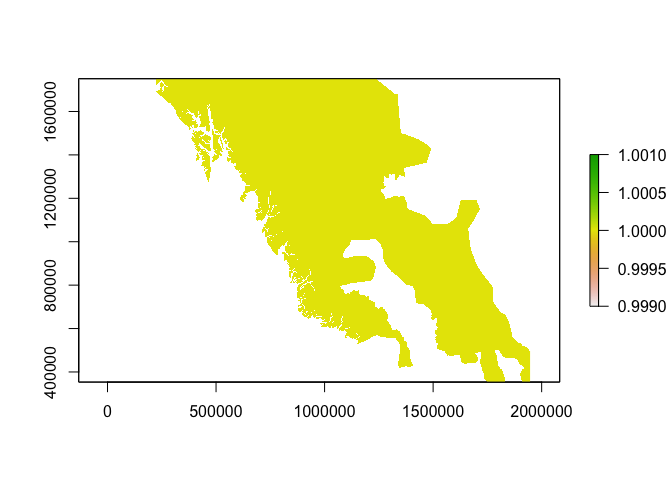
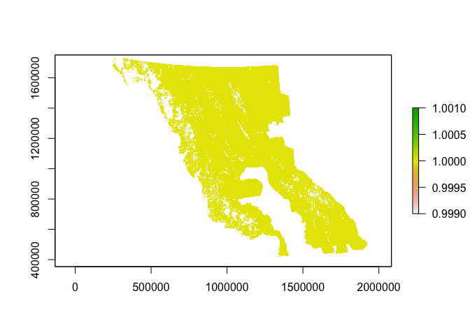
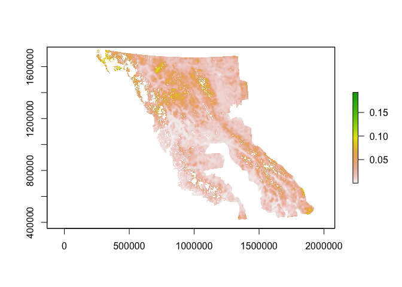
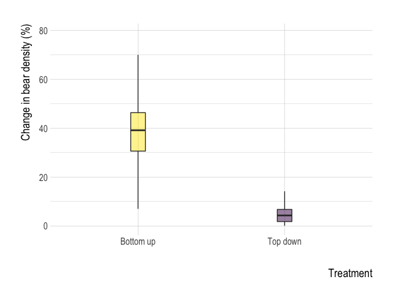
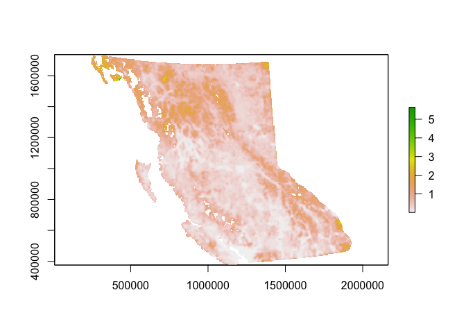
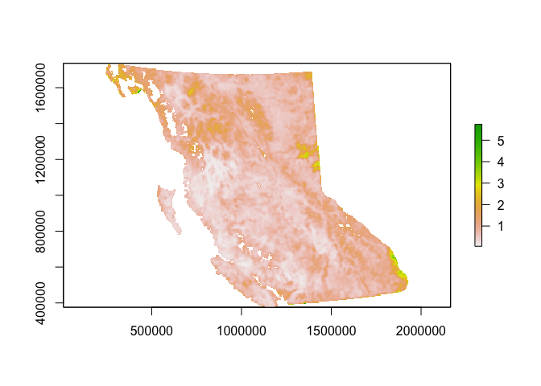

Grizzly bear BC SCR results
================
Clayton Lamb
29 July, 2021

## Load Packages & Data

``` r
library(here)
library(raster)
library(sf)
library(velox)
library(viridis)
library(stringr)
library(rgdal)
library(corrplot)
library(fasterize)
library(ggmap)
library(ggpubr)
library(lubridate)
library(mapview)
library(hrbrthemes)
library(foreach)
library(doParallel)
library(tabularaster)
library(ggrepel)
library(basemaps)
library(RStoolbox)
library(rworldmap)
library(maps)
library(ggsflabel)
library(oSCR)
library(knitr)
library(tidyverse)


###set official CRS
off.crs <- "+proj=aea +lat_0=45 +lon_0=-126 +lat_1=50 +lat_2=58.5 +x_0=1000000 +y_0=0 +datum=NAD83 +units=m +no_defs"

##################  
##LOAD DATA
################## 


###Get file paths
filelist = list.files(here::here("Data_Prep","CleanData","CapHists_SECR","CapData"),pattern = ".*.txt", full.names = TRUE)
filelist <- filelist[c(-13,-22, -23, -34,-37:-39)] ###remove sessions with few captures, or primarily rub tree, or outside of extant  grizz range

##load in data
caps <- filelist%>%
  map_df(read_csv)%>%
  as.data.frame()

##spatial data
STACK <- stack(list.files(here::here("Data_Prep", "CleanData", "rasters"),pattern = ".*.tif", full.names = TRUE))
proj4string(STACK) <- off.crs
```

## Data Cleaning and Prep

``` r
##rename columns
colnames(caps) <- c("Session", "ID", "Occassion","Detector", "Sex")

##append study area/year onto capture detectors to match trap file
caps <- mutate(caps, Detector=paste(Detector, Session, sep="_"))


######REMOVE RUB TREE TRAP DATA
rtculls<-data.frame()

filelist = list.files(here::here("Data_Prep","CleanData","CapHists_SECR","TrapData"),pattern = ".*.txt", full.names = TRUE)
filelist <- filelist[c(-13,-22, -23, -34,-37:-39)]
filenames <- list.files(here::here("Data_Prep","CleanData","CapHists_SECR","TrapData"),pattern = ".*.txt", full.names = FALSE)
filenames <- filenames[c(-13,-22, -23, -34,-37:-39)]
#filelist <- filelist[c(34)]
trap.list <- list()
n <-c()
for(i in 1:length(filelist)){
  a <- read_csv(filelist[i])
  colnames(a) <- c("Detector", "X", "Y", "Usage_1", "Trap_Type")
  a$sep="/"
  a <- a%>%mutate(Trap_Type=str_split(Trap_Type, "/ ", simplify = TRUE)[,2])%>%
    select("Detector", "X", "Y", "Usage_1", "sep", "Trap_Type")%>%
    mutate(Detector=paste(Detector, str_split(filenames[i], ".txt", simplify = TRUE)[,1], sep="_"))
  
  rtculls <- a%>%filter(Trap_Type%in%"RT")%>%
    select(Detector)%>%
    rbind(rtculls)
  
  a <-  a%>%filter(!Trap_Type%in%" RT")%>%
    select("Detector", "X", "Y", "Usage_1", "sep", "Trap_Type")
  
  use.len <-nchar(a$Usage_1[1])
  a <- tidyr::separate(a,Usage_1, into=paste("Usage",c(1:use.len), sep="_"),sep =c(1:(use.len-1)))
  
  trap.list[[i]]<- as.data.frame(a)
  
  n[i]<-length(unique(a$Detector))
  
  rm(a)
}

caps<- caps%>%
  filter(!Detector %in%rtculls$Detector) ##remove captures at rub trees

###PREP SOME DATA
##occassions per session
k <-caps%>%
  dplyr::group_by(Session)%>%
  dplyr::summarize(sess.max=max(Occassion))%>%
  pull(sess.max)  

##fix up sex column
caps<- caps%>%
  mutate(Sex=case_when(is.na(Sex)~"U", TRUE~Sex))


###SUMMARY STATS
length(unique(caps$ID))
length(unique(caps[caps$Sex%in%"M","ID"]))
length(unique(caps[caps$Sex%in%"F","ID"]))
length(unique(caps[caps$Sex%in%c("U"),"ID"]))
length(unique(caps$Session))
nrow(caps)
length(trap.list)
length(unique(bind_rows(trap.list)$Detector))
```

## MAP

``` r
##PLOT

##prep data
range <- st_read(here::here("Data_Prep", "Spatial_Layers_ProvSECR", "range.shp"))%>%st_transform(st_crs(STACK))
```

    ## Reading layer `range' from data source `/Users/clayton.lamb/Google Drive/Documents/University/U_A/Analyses/BC_Wide_PhD/Prov_Grizz_density_oSCR/Grizzly-Density-BC/Data_Prep/Spatial_Layers_ProvSECR/range.shp' using driver `ESRI Shapefile'
    ## Simple feature collection with 1 feature and 1 field
    ## geometry type:  MULTIPOLYGON
    ## dimension:      XY
    ## bbox:           xmin: -3932825 ymin: 478343.3 xmax: 552000 ymax: 4406030
    ## projected CRS:  Albers

``` r
df <- bind_rows(trap.list)%>%
  select(X,Y, Detector)%>%
  st_as_sf(coords = c("X","Y"),
           crs = off.crs)

##pull city data
data(world.cities)
cities <- world.cities%>%
  filter(lat>46 & lat< 620 & long>(-130) & long<(-110))%>%
  filter(pop>500000|name%in%c("Smithers","Missoula", "Fort Nelson", "Williams Lake"))%>%
  st_as_sf(coords = c("long","lat"),
           crs = 4326)%>%
  st_transform(st_crs(STACK))


##prep basemap
# register_google("xAIzaSyCOwGx2D77XOqRgGhKmcb5F4Kt_S61tCLIx")
# set_defaults(map_service = "osm", map_type = "terrain_bg")
# 
# 
# a <- basemap_raster(st_read("/Users/clayton.lamb/Google Drive/Documents/University/Geographic_Data/Basemaps/bc/shp/province.shp")%>%
#                       st_transform(3857)%>%
#                       st_buffer(400E3))
# a <- a%>%projectRaster(crs=3005)
# writeRaster(a,here::here("Data_Prep","CleanData","basemap","basemap.tif"))
a <- brick(here::here("Data_Prep","CleanData","basemap","basemap.tif"))

world <- getMap(resolution = "high")
world <- st_as_sf(world)
##prep extents
extent = matrix(c(3E5 ,2.5E5 , 3E5 , 17E5 , 20E5  , 17E5, 20E5 ,2.5E5 , 3E5 ,2.5E5  ),ncol=2, byrow=TRUE)
pts = list(extent)
pl1 = st_polygon(pts)
pl1 <- st_sfc(pl1, crs=3005)

inset <- ggplot() +
  geom_sf(data = world,size=0.1, fill="olivedrab", color="black") +
  geom_sf(data=range,alpha=0.5, size=0.2,fill="grey80",inherit.aes = FALSE)+
  geom_sf(data = pl1, fill=NA, color="black", size = 0.7) +
  coord_sf(crs = 3005)+
  theme(panel.grid.major = element_blank(),
        panel.grid.minor = element_blank(),
        axis.ticks = element_blank(),
        panel.background = element_rect(fill = "slategray3",colour = "black"),
        panel.border = element_rect(fill = NA, color = NA),
        axis.text = element_blank(),
        axis.title = element_blank(),
        plot.margin=unit(c(0,0,0,0),"mm"),
        legend.position = c(0.65,0.075),
        plot.background = element_rect(fill = "transparent",colour = NA))+
  xlim(-1E6,5.3E6)+
  ylim(-2E6,4.5E6)


map <- ggRGB(a, r=1, g=2, b=3)+
  theme_bw()+
  geom_sf(data=range,alpha=0.1, inherit.aes = FALSE)+
  geom_sf(data=df,size=0.4, pch = 21,alpha=0.6,inherit.aes = FALSE)+
  xlim(3E5,20E5)+
  ylim(2.5E5,17E5)+
  geom_sf(data=cities, inherit.aes = FALSE, color="grey40")+
  geom_sf_text_repel(data=cities, aes(label=name),inherit.aes = FALSE, size=3)+
  annotation_custom(ggplotGrob(inset), xmin =15.5E5, xmax = 21E5, ymin = 12.5E5, ymax = 17.5E5)+
  annotate("text", x = 5.8E5, y = 5E5, label = "Grizzly bear sampling sites", fontface=2)+
  annotate("text", x = 4.3E5, y = 4E5, label =paste( length(unique(caps$Session)) ,"Study-years",sep=" "),size=4)+
  annotate("text", x = 6.7E5, y = 3E5, label =paste(paste(nrow(caps),"Detections from",sep=" "), paste(length(unique(caps$ID)),"Individuals",sep=" "),sep=" "),size=4)+
  theme(axis.title = element_blank())


####map berry 
bec <- st_read(here::here("Data_Prep","Data","berry","bec.shp"))%>%st_transform(st_crs(STACK))
```

    ## Reading layer `bec' from data source `/Users/clayton.lamb/Google Drive/Documents/University/U_A/Analyses/BC_Wide_PhD/Prov_Grizz_density_oSCR/Grizzly-Density-BC/Data_Prep/Data/berry/bec.shp' using driver `ESRI Shapefile'
    ## Simple feature collection with 25341 features and 2 fields
    ## geometry type:  POINT
    ## dimension:      XY
    ## bbox:           xmin: -136.5668 ymin: 48.31525 xmax: -114.1967 ymax: 59.98048
    ## geographic CRS: GCS_unknown

``` r
occ <- ggRGB(a, r=1, g=2, b=3)+
  theme_bw()+
  geom_sf(data=bec,size=0.1, pch = 21,alpha=0.3,inherit.aes = FALSE)+
  xlim(3.2E5,18.5E5)+
  ylim(4E5,17E5)+
  geom_sf(data=cities, inherit.aes = FALSE, color="grey40")+
  annotate("text", x = 5.8E5, y = 5E5, label = "Shrub occurrence", fontface=2,size=3)+
  annotate("text", x = 5.6E5, y = 4E5, label = "25,341 plots",size=3)+
  theme(axis.title = element_blank())


prod <- st_read(here::here("Data_Prep","Data","berry","prod.shp"))%>%st_transform(st_crs(STACK))
```

    ## Reading layer `prod' from data source `/Users/clayton.lamb/Google Drive/Documents/University/U_A/Analyses/BC_Wide_PhD/Prov_Grizz_density_oSCR/Grizzly-Density-BC/Data_Prep/Data/berry/prod.shp' using driver `ESRI Shapefile'
    ## Simple feature collection with 1566 features and 2 fields
    ## geometry type:  POINT
    ## dimension:      XY
    ## bbox:           xmin: -131.5608 ymin: 49.00271 xmax: -114.2046 ymax: 59.55624
    ## geographic CRS: GCS_unknown

``` r
prod%>%
distinct(geometry)%>%
  tally()
```

    ## Simple feature collection with 1 feature and 1 field
    ## geometry type:  MULTIPOINT
    ## dimension:      XY
    ## bbox:           xmin: 662523.7 ymin: 477309.9 xmax: 1858562 ymax: 1619300
    ## CRS:            +proj=aea +lat_0=45 +lon_0=-126 +lat_1=50 +lat_2=58.5 +x_0=1000000 +y_0=0 +datum=NAD83 +units=m +no_defs
    ##      n                       geometry
    ## 1 1264 MULTIPOINT ((662523.7 13418...

``` r
prod.map <- ggRGB(a, r=1, g=2, b=3)+
  theme_bw()+
  geom_sf(data=prod,size=0.5, pch = 21,inherit.aes = FALSE)+
  xlim(3.2E5,18.5E5)+
  ylim(4E5,17E5)+
  geom_sf(data=cities, inherit.aes = FALSE, color="grey40")+
  annotate("text", x = 5.8E5, y = 5E5, label = "Fruit productivity", fontface=2,size=3)+
  annotate("text", x = 5.6E5, y = 4E5, label = "1,566 plots",size=3)+
  theme(axis.title = element_blank())


ggarrange(map,                                                
          ggarrange(occ, prod.map, ncol = 2, labels = c("B", "C")),
          nrow = 2, 
          labels = "A",
          heights=c(2,1))
```

<!-- -->

``` r
ggsave(here::here("output", "plots", "map_paper.png"), height=8, width=8, unit="in")
rm(a)
rm(bec)
rm(cities)
rm(inset)
rm(map)
rm(prod)
rm(prod.map)
rm(occ)
rm(world)
rm(world.cities)
rm(extent)
rm(pl1)
rm(pts)
rm(bbox_clip)
```

## Get data into oSCR format

``` r
######
##add in trap covariates for custom session specs
######

##manually specified
# filelist%>%str_split("/", simplify = TRUE)%>%as_tibble%>%pull(V16) ##get order
# caps%>%group_by(Session)%>%summarize(n=n_distinct(ID,Occassion,Detector))%>%print(n=42) ##see caps, helps to decide groups
d.pool <- factor(c("a1", "a2","a3","a4","a5","a6","a7","a8","a9","a10","Stikine","Stikine", "Nass","Nass","a15","a16","a17","a18","a19","a20",
                   "a21","NorthPurc","SPurc", "a24", "SR","SR","SR","SR","SR","SR","SR","SR","SR","a34","SN","SN","SN","SN","SN","SN","a41","a42","a42","a42"))

ph.pool <- factor(c("Grp1","Grp2","Grp3","Grp4","Grp7","Grp7","SR","KG","Grp1","Stikine",
                    "Stikine","Stikine", "SR","SR","Grp5","Grp5","Grp3","Grp2","PWC","Grp5",
                   "Grp6","Grp1","Grp1", "Grp4", "SR","SR","SR","SR","SR","SR","SR","SR","SR",
                   "PWC","SN","SN","SN","SN","SN","SN","Grp4","Grp2","Grp2","Grp2"))

length(levels(d.pool))
```

    ## [1] 27

``` r
length(levels(ph.pool))
```

    ## [1] 12

``` r
##ADD
for(i in 1:length(trap.list)){
  trap.list[[i]]$d.pool <- d.pool[i]
  trap.list[[i]]$ph.pool <- ph.pool[i]
}


####################################
######GET INTO OSCR FORMAT
####################################
caps$Sex <- as.factor(caps$Sex)
ms.data <- data2oscr(edf=caps, 
                     tdf=trap.list,
                     sess.col=which(colnames(caps) %in% "Session"),
                     id.col=which(colnames(caps) %in% "ID"),
                     occ.col=which(colnames(caps) %in% "Occassion"),
                     trap.col=which(colnames(caps) %in% "Detector"),
                     sex.col=which(colnames(caps) %in% "Sex"),
                     sex.nacode="U",
                     trapcov.names=c("d.pool","ph.pool"),
                     K=k,
                     ntraps=n,
                     tdf.sep="/")


ms.sf <- ms.data$scrFrame
```

## PREP MASK OF INTEGRATION

``` r
ms.ssDF <- make.ssDF(ms.sf, buffer=35E3, res = 5E3)

## habitat mask
hab <- raster(here::here("Data_Prep", "Spatial_Layers_ProvSECR", "clean", "nonhab.tif"))

###smooth a bit
hab <- focal(hab, w=matrix(1,9,9), fun=mean, na.rm=TRUE,pad=TRUE, padValue=1)%>%
  projectRaster(STACK[[1]])##smooth over ~2500 km2, i.e, the mask size (5x5 km)
hab <-hab>0.6
hab[hab==1] <-NA
hab[hab==0] <-1
plot(hab)
```

<!-- -->

``` r
writeRaster(hab,here::here("Data_Prep", "Spatial_Layers_ProvSECR", "hab", "hab.tif"), overwrite=TRUE)

##range mask
range <- st_read(here::here("Data_Prep", "Spatial_Layers_ProvSECR", "range.shp"))%>%
  st_transform(proj4string(STACK[[1]]))%>%
  fasterize(hab, field = "Dis", fun="first")
```

    ## Reading layer `range' from data source `/Users/clayton.lamb/Google Drive/Documents/University/U_A/Analyses/BC_Wide_PhD/Prov_Grizz_density_oSCR/Grizzly-Density-BC/Data_Prep/Spatial_Layers_ProvSECR/range.shp' using driver `ESRI Shapefile'
    ## Simple feature collection with 1 feature and 1 field
    ## geometry type:  MULTIPOLYGON
    ## dimension:      XY
    ## bbox:           xmin: -3932825 ymin: 478343.3 xmax: 552000 ymax: 4406030
    ## projected CRS:  Albers

``` r
plot(range)
```

<!-- -->

``` r
mask.ms <- (hab*range)
plot(mask.ms)
```

<!-- -->

``` r
mask.ms.buff <- hab*(st_read(here::here("Data_Prep", "Spatial_Layers_ProvSECR", "range.shp"))%>%
  st_transform(proj4string(hab))%>%
  st_buffer(15E3)%>%
  fasterize(hab, field = "Dis", fun="first"))
```

    ## Reading layer `range' from data source `/Users/clayton.lamb/Google Drive/Documents/University/U_A/Analyses/BC_Wide_PhD/Prov_Grizz_density_oSCR/Grizzly-Density-BC/Data_Prep/Spatial_Layers_ProvSECR/range.shp' using driver `ESRI Shapefile'
    ## Simple feature collection with 1 feature and 1 field
    ## geometry type:  MULTIPOLYGON
    ## dimension:      XY
    ## bbox:           xmin: -3932825 ymin: 478343.3 xmax: 552000 ymax: 4406030
    ## projected CRS:  Albers

``` r
##create function to clip mask of integration by habitat areas only
ms.clipmask <- function(ssDF,raster,p.intact){
  if (!proj4string(raster)%in% c(off.crs, "+proj=aea +lat_0=45 +lon_0=-126 +lat_1=50 +lat_2=58.5 +x_0=1000000 +y_0=0 +datum=NAD83 +units=m +no_defs +ellps=GRS80 +towgs84=0,0,0")) {
    cat("fix proj to official crs (off.crs)", 
        fill = TRUE)
    return(NULL)
  }
  
  
  
  for(i in 1:length(ssDF)){
    a<-tibble(X=ssDF[[i]][,1],
              Y=ssDF[[i]][,2])%>%
      st_as_sf(coords = c("X","Y"),
               crs = "+proj=aea +lat_1=50 +lat_2=58.5 +lat_0=45 +lon_0=-126 +x_0=1000000 +y_0=0 +datum=NAD83 +units=m +no_defs +ellps=GRS80 +towgs84=0,0,0")
    
    
    a <- a%>%mutate(cull=velox(raster)$extract_points(a))%>%
      mutate(X=st_coordinates(.)[,1],
             Y=st_coordinates(.)[,2],
             Tr=1)%>%
      as_tibble()%>%
      filter(cull>p.intact)%>%
      select(X,Y,Tr)%>%
      as.data.frame()
    
    
    ssDF[[i]]<-a
  }
  
  return(ssDF)
}

##clip
ms.ssDF <- ms.clipmask(ssDF=ms.ssDF, 
                       raster=mask.ms,
                       p.intact=0.5) ##arbitrary, as the mask is 1/0 so anything in between will split them
#plot(ms.ssDF,ms.sf)

saveRDS(ms.ssDF, here::here("Data_Prep", "Spatial_Layers_ProvSECR","clean","state_space.rds"))

# ggplot(data=ms.ssDF[[31]],aes(x=X,y=Y,fill=Tr))+geom_raster()+
#   scale_fill_gradientn(colors=rev(viridis_pal()(20)))+theme_minimal()


###cleanup objects
rm(df)
rm(map)
rm(rtculls)
rm(caps)
rm(trap.list)
rm(bbox)
rm(basemap)
rm(ms.data)

###mask extract function
#function
ms.addcovs <- function(ssDF,rasterstack){
  if (!proj4string(rasterstack)%in% c(off.crs, "+proj=aea +lat_0=45 +lon_0=-126 +lat_1=50 +lat_2=58.5 +x_0=1000000 +y_0=0 +datum=NAD83 +units=m +no_defs +ellps=GRS80 +towgs84=0,0,0")) {
    cat("fix proj to official crs (off.crs)", 
        fill = TRUE)
    return(NULL)
  }
  
  
  for(i in 1:length(ssDF)){
    a<-tibble(X=ssDF[[i]][,1],
              Y=ssDF[[i]][,2])%>%
      st_as_sf(coords = c("X","Y"),
               crs = off.crs)%>%
      as("Spatial")
    
    
    
    ##extract stack
    a <- raster::extract(rasterstack,a, na.rm=TRUE, fun=mean, df=TRUE)
    
    ##add to ssDF
    ssDF[[i]]<-cbind(ssDF[[i]],a%>%select(-ID))
    
    print(paste(i, "of", length(ssDF), "sessions", sep=" "))
    
  }
  
  return(ssDF)
}
```

## EXTRACT RASTER VALUES TO MASK

``` r
#ms.ssDF <- readRDS(here::here("Data_Prep", "Spatial_Layers_ProvSECR","clean","state_space.rds"))

ms.ssDF <- ms.addcovs(ssDF=ms.ssDF,
                      rasterstack=STACK)

saveRDS(ms.ssDF, here::here("Data_Prep", "Spatial_Layers_ProvSECR","clean","state_space_vars.rds"))
```

## LOAD MASK (FOR SPEED)

``` r
ms.ssDF <- readRDS(here::here("Data_Prep", "Spatial_Layers_ProvSECR","clean","state_space_vars.rds"))

##plot
ms.ssDF[[31]]%>%
  select(X, Y, cc_scale, fruit_cal_sum_subset_trim_scale, secure_scale)%>%
  gather("vari", "value", -X,-Y)%>%
  ggplot(aes(x=X,y=Y,fill=value))+geom_raster()+
  scale_fill_gradientn(colors=rev(viridis_pal()(20)))+
  theme_minimal()+
  facet_wrap( ~ vari, ncol=3)
```

<!-- -->

``` r
###PLOT
cor.dat <-ms.ssDF
class(cor.dat) <-"list"
M <- cor(dplyr::bind_rows(cor.dat, .id = "column_label")%>%
      select(fruit_cal_sum_subset_trim_scale , vacc_scale, vacc2_scale, f.alt_scale,sprveg_scale, commonveg_scale,ndvi_scale, cc_scale, deltaNDVI_scale , salm_iso_gm_scale,salm_tony_scale, salm_ce_diversity_scale, meat_iso_gm_scale, secure_scale , bb_scale , hum_dens_log_scale, isolation_scale,attractants_log_scale,PINUALB_occcov_scale), use="complete.obs")

corrplot(M, method = "circle", type = "upper", order = "hclust")
```

<!-- -->

## ADD POOLED SESSION SPECIFICATION AND SUMMARIZE CAPTURE DATA AGAIN, MAKE SURE ALL IS GOOD

``` r
##############################
#### POOLED DENSITY SPECIFICATION
##############################
for(i in 1:length(ms.ssDF)){
  ms.ssDF[[i]]$d.pool <- d.pool[i]
    ms.ssDF[[i]]$ph.pool <- ph.pool[i]
}

ms.sf$sigCovs$d.pool <- sapply(ms.ssDF,function(x)x$d.pool[1])
ms.sf$sigCovs$ph.pool <- sapply(ms.ssDF,function(x)x$ph.pool[1])
##summarize captures
ms.sf
```

    ## 
    ## 
    ## 
    ## Pooled MMDM:  11896.88

## FIT FIRST ROUND OF SCR MODELS, TEST DETECTION

``` r
################
###start with seeing if it is possible to fit session-specific models, didn't work,
#decided to pool similar sessions
################
sess.pool.mod <- oSCR::oSCR.fit(
        model = list(D ~ d.pool, p0 ~ d.pool + sex + b, sig ~ d.pool + sex),
        scrFrame=ms.sf,
        ssDF=ms.ssDF,
        trimS=35E3)

saveRDS(sess.pool.mod, here::here("output", "mods", "sess.pool.mod.RDS"))
```

## PLOT RESULTS, POOL SESSIONS

``` r
#load models
sess.pool.mod <- readRDS(here::here("output", "mods", "sess.pool.mod.RDS"))


###predict results
#make a dataframe of values predictions
pred.df <- data.frame(session=filelist%>%str_split("/", simplify = TRUE)%>%as_tibble%>%pull(V16)%>%str_sub(1,-5),
                        pool = as.character(d.pool),
                        d.pool = as.character(d.pool),
                      sex=factor(1,levels=c(0,1)),
                      b=0,
                        lab=ph.pool)%>%
  dplyr::mutate(session=case_when(!session%in%c("HWY3_2004","HWY3_2005","Region_2004","Region_2007","S_Purcell_1998","S_Purcell_2001")~str_sub(session,1,-6),
                           TRUE~session%>%as.character()))
#now predict
d.preds <- get.real(model = sess.pool.mod, newdata = pred.df)

sig.preds <- get.real(model = sess.pool.mod, type = "sig", newdata = pred.df)

p0.preds <- get.real(model = sess.pool.mod, type = "det", newdata = pred.df)


##sex column is duplicated, rename
names(d.preds) <- make.unique(names(d.preds))


##drop numeric sex
d.preds <-d.preds%>%select(-sex)%>%rename(sex=sex.1)

#put together
d <-d.preds%>%
  distinct(session,sex, .keep_all = TRUE)%>%
  group_by( session,d.pool,lab)%>%
  summarise_at(vars(estimate,se,lwr,upr), ~ sum(.x)*40)%>%
  left_join(sig.preds%>%select(session, sig=estimate,sig.se=se))%>%
  left_join(p0.preds%>%select(session, p0=estimate,p0.se=se))%>%
  distinct(d.pool, .keep_all=TRUE)

###PLOT with groups
ggplot(d, aes(x=estimate,y=sig))+
  geom_point()+
 theme_ipsum()+
     theme(axis.title.x = element_text(size=15, vjust=-7),
        axis.title.y = element_text(size=15, vjust=2),
        axis.text.x = element_text(size=12),
        axis.text.y = element_text(size=12),
        plot.title = element_text(size=22),
        plot.subtitle = element_text(size=17))+
  labs(title="Density and home range index (Sigma)",
       x="Density", y="Sigma")
```

<!-- -->

``` r
ggplot(data=d, aes(x=p0,y=sig, label=session))+
  geom_point(data=d, aes(x=p0,y=sig, label=session, color=lab), size=2)+
  geom_errorbar(data=d, aes(xmin=p0-p0.se, xmax=p0+p0.se, color=lab))+
    geom_errorbar(data=d, aes(ymin=sig-sig.se, ymax=sig+sig.se, color=lab))+
  theme_ipsum()+
  geom_text_repel(segment.size  = 0.2,
    segment.color = "grey50",
    size=3)+
   theme(axis.title.x = element_text(size=15, vjust=-7),
        axis.title.y = element_text(size=15, vjust=2),
        axis.text.x = element_text(size=12),
        axis.text.y = element_text(size=12),
        plot.title = element_text(size=22),
        plot.subtitle = element_text(size=17),
        legend.position = "bottom")+
  labs(title="Sigma vs p0, with detection groups identified",
       x="p0", y="Sigma", color="Detection group")+
  scale_color_brewer(palette="Paired")
```

<!-- -->

``` r
lm(sig~estimate, d)%>%summary()
```

    ## 
    ## Call:
    ## lm(formula = sig ~ estimate, data = d)
    ## 
    ## Residuals:
    ##     Min      1Q  Median      3Q     Max 
    ## -5212.3 -1065.2   221.4  1140.6  4142.8 
    ## 
    ## Coefficients:
    ##             Estimate Std. Error t value Pr(>|t|)    
    ## (Intercept) 11632.51     937.03  12.414 3.46e-12 ***
    ## estimate     -140.77      42.47  -3.315   0.0028 ** 
    ## ---
    ## Signif. codes:  0 '***' 0.001 '**' 0.01 '*' 0.05 '.' 0.1 ' ' 1
    ## 
    ## Residual standard error: 2019 on 25 degrees of freedom
    ## Multiple R-squared:  0.3053, Adjusted R-squared:  0.2775 
    ## F-statistic: 10.99 on 1 and 25 DF,  p-value: 0.002802

``` r
lm(p0~estimate, d)%>%summary()
```

    ## 
    ## Call:
    ## lm(formula = p0 ~ estimate, data = d)
    ## 
    ## Residuals:
    ##       Min        1Q    Median        3Q       Max 
    ## -0.060470 -0.018304 -0.002018  0.012462  0.069642 
    ## 
    ## Coefficients:
    ##              Estimate Std. Error t value Pr(>|t|)   
    ## (Intercept) 0.0445593  0.0145141    3.07   0.0051 **
    ## estimate    0.0008550  0.0006578    1.30   0.2055   
    ## ---
    ## Signif. codes:  0 '***' 0.001 '**' 0.01 '*' 0.05 '.' 0.1 ' ' 1
    ## 
    ## Residual standard error: 0.03128 on 25 degrees of freedom
    ## Multiple R-squared:  0.0633, Adjusted R-squared:  0.02583 
    ## F-statistic: 1.689 on 1 and 25 DF,  p-value: 0.2055

``` r
lm(sig~p0, d)%>%summary()
```

    ## 
    ## Call:
    ## lm(formula = sig ~ p0, data = d)
    ## 
    ## Residuals:
    ##     Min      1Q  Median      3Q     Max 
    ## -4486.2 -1558.7   211.7  1509.3  5166.1 
    ## 
    ## Coefficients:
    ##             Estimate Std. Error t value Pr(>|t|)    
    ## (Intercept)  10876.3      926.8  11.735 1.16e-11 ***
    ## p0          -33536.1    13409.4  -2.501   0.0193 *  
    ## ---
    ## Signif. codes:  0 '***' 0.001 '**' 0.01 '*' 0.05 '.' 0.1 ' ' 1
    ## 
    ## Residual standard error: 2167 on 25 degrees of freedom
    ## Multiple R-squared:  0.2001, Adjusted R-squared:  0.1681 
    ## F-statistic: 6.255 on 1 and 25 DF,  p-value: 0.0193

## TEST DETECTION

``` r
mods.det <- make.mods(density= c(~d.pool),
                    detection = c(~1,
                                  ~sex,
                                  ~sex + b,
                                  ~ph.pool,
                                  ~ph.pool + sex,
                                  ~ph.pool + sex + b), 
                    sigma = c(~1,
                                  ~sex,
                                  ~ph.pool,
                                  ~ph.pool + sex))

# keep a subset of models to test, needn't be every pairwise option
mods.det <-mods.det[c(1,6,10,15,20,24),]


##run in parallel
cl <- makeCluster(6)    #make the cluster
registerDoParallel(cl)  #register the cluster

mods.det.out <- foreach(i=1:nrow(mods.det),.packages = "oSCR") %dopar% {
  
  m <- list(mods.det[i,1][[1]], # ith model
            mods.det[i,2][[1]],
            mods.det[i,3][[1]],
            mods.det[i,4][[1]]) 
  
  out <- oSCR.fit(m, ms.sf, ssDF=ms.ssDF, trimS=35E3)
  return(out)
}

stopCluster(cl)


 ##examine model fits
(fitList.oSCR(mods.det.out)%>%
  modSel.oSCR())$aic.tab%>%
  as_tibble()

##save outputs
(fitList.oSCR(mods.det.out)%>%
    modSel.oSCR())$aic.tab%>%
  as_tibble()%>%
  write_csv(here::here("output", "tables", "mods.det.mods.csv"))


saveRDS(mods.det.out, here::here("output", "mods", "det.mods.RDS"))
```

## PLOT RESULTS

``` r
mods.det.out <- readRDS(here::here("output", "mods", "det.mods.RDS"))

##fit
(fitList.oSCR(mods.det.out)%>%
  modSel.oSCR())$aic.tab%>%
  as_tibble()%>%
  kable()
```

| model |     logL |  K |      AIC |      dAIC | weight | CumWt |
| :---- | -------: | -: | -------: | --------: | -----: | ----: |
| 6     | 13296.12 | 55 | 26702.25 |    0.0000 |      1 |     1 |
| 5     | 13442.74 | 54 | 26993.48 |  291.2347 |      0 |     1 |
| 3     | 13480.70 | 33 | 27027.41 |  325.1614 |      0 |     1 |
| 4     | 13634.68 | 52 | 27373.37 |  671.1184 |      0 |     1 |
| 2     | 13694.36 | 32 | 27452.73 |  750.4786 |      0 |     1 |
| 1     | 13898.02 | 30 | 27856.03 | 1153.7856 |      0 |     1 |

``` r
###predict results
#make a dataframe of values predictions
pred.df <- data.frame(session=filelist%>%str_split("/", simplify = TRUE)%>%as_tibble%>%pull(V16)%>%str_sub(1,-5),
                        pool = as.character(d.pool),
                        d.pool = as.character(d.pool),
                        ph.pool = as.character(ph.pool),
                      sex=factor(1,levels=c(0,1)),
                      b=0,
                        lab=ph.pool)%>%
  dplyr::mutate(session=case_when(!session%in%c("HWY3_2004","HWY3_2005","Region_2004","Region_2007","S_Purcell_1998","S_Purcell_2001")~str_sub(session,1,-6),
                           TRUE~session%>%as.character()))


#now predict
d.preds <- get.real(model = mods.det.out[[6]], newdata = pred.df)

sig.preds <- get.real(model = mods.det.out[[6]], type = "sig", newdata = pred.df)

p0.preds <- get.real(model = mods.det.out[[6]], type = "det", newdata = pred.df)

##sex column is duplicated, rename
names(d.preds) <- make.unique(names(d.preds))

##drop numeric sex
d.preds <-d.preds%>%select(-sex)%>%rename(sex=sex.1)

#put together
d2 <-d.preds%>%
  distinct(session,sex, .keep_all = TRUE)%>%
  group_by( session,d.pool,lab)%>%
  summarise_at(vars(estimate,se,lwr,upr), ~ sum(.x)*40)%>%
  left_join(sig.preds%>%select(session, sig=estimate,sig.se=se))%>%
  left_join(p0.preds%>%select(session, p0=estimate,p0.se=se))%>%
  distinct(d.pool, .keep_all=TRUE)

###PLOT with groups
ggplot(data=d2, aes(x=p0,y=sig, label=session))+
  geom_point(data=d2, aes(x=p0,y=sig, color=lab), size=2)+
  theme_ipsum()+
  # geom_text_repel(segment.size  = 0.2,
  #   segment.color = "grey50",
  #   size=3)+
   theme(axis.title.x = element_text(size=15, vjust=-7),
        axis.title.y = element_text(size=15, vjust=2),
        axis.text.x = element_text(size=12),
        axis.text.y = element_text(size=12),
        plot.title = element_text(size=22),
        plot.subtitle = element_text(size=17),
        legend.position = "bottom")+
  labs(title="Sigma vs p0, with detection groups identified",
       x="p0", y="Sigma", color="Detection group")+
  scale_color_brewer(palette="Paired")
```

<!-- -->

``` r
ggplot(d2, aes(x=estimate,y=sig))+
  geom_point()+
 theme_ipsum()+
     theme(axis.title.x = element_text(size=15, vjust=-7),
        axis.title.y = element_text(size=15, vjust=2),
        axis.text.x = element_text(size=12),
        axis.text.y = element_text(size=12),
        plot.title = element_text(size=22),
        plot.subtitle = element_text(size=17))+
  labs(title="Density and home range index (Sigma)",
       x="Density", y="Sigma")
```

<!-- -->

``` r
lm(sig~estimate, d2%>%ungroup%>%distinct(sig,.keep_all = TRUE))%>%summary()
```

    ## 
    ## Call:
    ## lm(formula = sig ~ estimate, data = d2 %>% ungroup %>% distinct(sig, 
    ##     .keep_all = TRUE))
    ## 
    ## Residuals:
    ##     Min      1Q  Median      3Q     Max 
    ## -4286.7  -709.1   754.5   916.1  2599.7 
    ## 
    ## Coefficients:
    ##             Estimate Std. Error t value Pr(>|t|)    
    ## (Intercept) 10570.88    1327.65   7.962 1.23e-05 ***
    ## estimate      -95.80      58.99  -1.624    0.135    
    ## ---
    ## Signif. codes:  0 '***' 0.001 '**' 0.01 '*' 0.05 '.' 0.1 ' ' 1
    ## 
    ## Residual standard error: 1961 on 10 degrees of freedom
    ## Multiple R-squared:  0.2087, Adjusted R-squared:  0.1296 
    ## F-statistic: 2.638 on 1 and 10 DF,  p-value: 0.1354

``` r
lm(p0~estimate, d2%>%ungroup%>%distinct(sig,.keep_all = TRUE))%>%summary()
```

    ## 
    ## Call:
    ## lm(formula = p0 ~ estimate, data = d2 %>% ungroup %>% distinct(sig, 
    ##     .keep_all = TRUE))
    ## 
    ## Residuals:
    ##       Min        1Q    Median        3Q       Max 
    ## -0.037755 -0.016932 -0.001588  0.007832  0.062203 
    ## 
    ## Coefficients:
    ##              Estimate Std. Error t value Pr(>|t|)  
    ## (Intercept) 0.0541010  0.0207875   2.603   0.0264 *
    ## estimate    0.0005953  0.0009236   0.645   0.5337  
    ## ---
    ## Signif. codes:  0 '***' 0.001 '**' 0.01 '*' 0.05 '.' 0.1 ' ' 1
    ## 
    ## Residual standard error: 0.0307 on 10 degrees of freedom
    ## Multiple R-squared:  0.03989,    Adjusted R-squared:  -0.05612 
    ## F-statistic: 0.4155 on 1 and 10 DF,  p-value: 0.5337

``` r
lm(sig~p0, d2%>%ungroup%>%distinct(sig,.keep_all = TRUE))%>%summary()
```

    ## 
    ## Call:
    ## lm(formula = sig ~ p0, data = d2 %>% ungroup %>% distinct(sig, 
    ##     .keep_all = TRUE))
    ## 
    ## Residuals:
    ##     Min      1Q  Median      3Q     Max 
    ## -3640.5 -1094.2   258.9  1547.9  2639.2 
    ## 
    ## Coefficients:
    ##             Estimate Std. Error t value Pr(>|t|)    
    ## (Intercept)    10557       1460   7.233 2.82e-05 ***
    ## p0            -29238      20235  -1.445    0.179    
    ## ---
    ## Signif. codes:  0 '***' 0.001 '**' 0.01 '*' 0.05 '.' 0.1 ' ' 1
    ## 
    ## Residual standard error: 2005 on 10 degrees of freedom
    ## Multiple R-squared:  0.1727, Adjusted R-squared:   0.09 
    ## F-statistic: 2.088 on 1 and 10 DF,  p-value: 0.1791

``` r
d%>%
  left_join(d2, by="session")%>%
  ggplot(aes(x=estimate.x,y=estimate.y, label=session))+
  geom_point()+
    theme_ipsum()+
  geom_text_repel(segment.size  = 0.2,
    segment.color = "grey50",
    size=3)+
   theme(axis.title.x = element_text(size=15, vjust=-7),
        axis.title.y = element_text(size=15, vjust=2),
        axis.text.x = element_text(size=12),
        axis.text.y = element_text(size=12),
        plot.title = element_text(size=22),
        plot.subtitle = element_text(size=17),
        legend.position = "bottom")+
      geom_abline(intercept = 0, slope = 1)+
  labs(x="Density, detection unpooled", y="Density, detection pooled")
```

<!-- -->

``` r
d%>%
  left_join(d2, by="session")%>%
  ggplot(aes(x=se.x,y=se.y, label=session))+
  geom_point()+
    theme_ipsum()+
  geom_text_repel(segment.size  = 0.2,
    segment.color = "grey50",
    size=3)+
   theme(axis.title.x = element_text(size=15, vjust=-7),
        axis.title.y = element_text(size=15, vjust=2),
        axis.text.x = element_text(size=12),
        axis.text.y = element_text(size=12),
        plot.title = element_text(size=22),
        plot.subtitle = element_text(size=17),
        legend.position = "bottom")+
      geom_abline(intercept = 0, slope = 1)+
  labs(x="Density error, detection unpooled", y="Density error, detection pooled")
```

<!-- -->

``` r
d%>%
  left_join(d2, by="session")%>%
  ggplot(aes(x=sig.x,y=sig.y, label=session))+
  geom_point()+
    theme_ipsum()+
  geom_text_repel(segment.size  = 0.2,
    segment.color = "grey50",
    size=3)+
   theme(axis.title.x = element_text(size=15, vjust=-7),
        axis.title.y = element_text(size=15, vjust=2),
        axis.text.x = element_text(size=12),
        axis.text.y = element_text(size=12),
        plot.title = element_text(size=22),
        plot.subtitle = element_text(size=17),
        legend.position = "bottom")+
      geom_abline(intercept = 0, slope = 1)+
  labs(x="Sigma, detection unpooled", y="Sigma, detection pooled")
```

<!-- -->

``` r
d%>%
  left_join(d2, by="session")%>%
  ggplot(aes(x=p0.x,y=p0.y, label=session))+
  geom_point()+
    theme_ipsum()+
  geom_text_repel(segment.size  = 0.2,
    segment.color = "grey50",
    size=3)+
   theme(axis.title.x = element_text(size=15, vjust=-7),
        axis.title.y = element_text(size=15, vjust=2),
        axis.text.x = element_text(size=12),
        axis.text.y = element_text(size=12),
        plot.title = element_text(size=22),
        plot.subtitle = element_text(size=17),
        legend.position = "bottom")+
      geom_abline(intercept = 0, slope = 1)+
  labs(x="p0, detection unpooled", y="p0, detection pooled")
```

<!-- -->

``` r
####WHERE's BURNT
d%>%
  left_join(d2, by="session")%>%
  ggplot(aes(x=sig.se.x,y=sig.se.y, label=session))+
  geom_point()+
    theme_ipsum()+
  geom_text_repel(segment.size  = 0.2,
    segment.color = "grey50",
    size=3)+
   theme(axis.title.x = element_text(size=15, vjust=-7),
        axis.title.y = element_text(size=15, vjust=2),
        axis.text.x = element_text(size=12),
        axis.text.y = element_text(size=12),
        plot.title = element_text(size=22),
        plot.subtitle = element_text(size=17),
        legend.position = "bottom")+
      geom_abline(intercept = 0, slope = 1)+
  labs(x="Sigma error, detection unpooled", y="Sigma error, detection pooled")
```

<!-- -->

``` r
d%>%
  left_join(d2, by="session")%>%
  ggplot(aes(x=p0.se.x,y=p0.se.y, label=session))+
  geom_point()+
    theme_ipsum()+
  geom_text_repel(segment.size  = 0.2,
    segment.color = "grey50",
    size=3)+
   theme(axis.title.x = element_text(size=15, vjust=-7),
        axis.title.y = element_text(size=15, vjust=2),
        axis.text.x = element_text(size=12),
        axis.text.y = element_text(size=12),
        plot.title = element_text(size=22),
        plot.subtitle = element_text(size=17),
        legend.position = "bottom")+
      geom_abline(intercept = 0, slope = 1)+
  labs(x="p0 error, detection unpooled", y="p0 error, detection pooled")
```

<!-- -->

## TEST CANDIDATE DENSITY MODELS

``` r
mods.d <- make.mods(density= c(~secure_scale + hum_dens_log_scale, ##top down only
                               ~vacc_scale + ndvi_scale + cc_scale + salm_iso_gm_scale + meat_iso_gm_scale, ##bottom up only
                               ~vacc_scale + ndvi_scale + cc_scale + salm_iso_gm_scale + meat_iso_gm_scale + secure_scale + hum_dens_log_scale, ##together
                               ~vacc_scale + ndvi_scale + cc_scale + salm_iso_gm_scale + secure_scale + hum_dens_log_scale, ##together without meat
                               ~vacc_scale + ndvi_scale + cc_scale + secure_scale + hum_dens_log_scale, ##together without salmon
                               ~salm_iso_gm_scale + meat_iso_gm_scale + secure_scale + hum_dens_log_scale, ##meat + top down
                               ~ndvi_scale + cc_scale + secure_scale + hum_dens_log_scale, ##green + top down
                               ~vacc_scale + ndvi_scale + cc_scale + salm_iso_gm_scale + salm_ce_diversity_scale + meat_iso_gm_scale + hum_dens_log_scale, ##together without secure
                               ~vacc_scale + ndvi_scale + cc_scale + salm_iso_gm_scale + secure_scale + hum_dens_log_scale, #together without meat 
                               ~vacc_scale + ndvi_scale + cc_scale + salm_iso_gm_scale + secure_scale + hum_dens_log_scale + bb_scale, #plus bb
                               ~vacc_scale + ndvi_scale + cc_scale + salm_iso_gm_scale + secure_scale + hum_dens_log_scale + isolation_scale, #plus isolation
                               ~vacc_scale + ndvi_scale + cc_scale + salm_iso_gm_scale + secure_scale + hum_dens_log_scale + PINUALB_occcov_scale), #whitebark pine
                    detection = c(~sex + ph.pool + b), 
                    sigma = c(~sex + ph.pool))


##run in parallel
cl <- makeCluster(4)    #make the cluster
registerDoParallel(cl)  #register the cluster

mods.d.out <- foreach(i=1:nrow(mods.d),.packages = "oSCR") %dopar% {
  
  m <- list(mods.d[i,1][[1]], # ith model
            mods.d[i,2][[1]],
            mods.d[i,3][[1]],
            mods.d[i,4][[1]]) 
  
  out <- oSCR.fit(m, ms.sf, ssDF=ms.ssDF, trimS=35E3)
  return(out)
}

stopCluster(cl)


 ##examine model fits
(fitList.oSCR(mods.d.out)%>%
  modSel.oSCR())$aic.tab%>%
  as_tibble()

##save outputs
(fitList.oSCR(mods.d.out)%>%
    modSel.oSCR())$aic.tab%>%
  as_tibble()%>%
  write_csv(here::here("output", "tables", "dens.mods.csv"))


saveRDS(mods.d.out, here::here("output", "mods", "dens.mods.RDS"))
```

## RESULTS

``` r
##load
mods.d.out <- readRDS(here::here("output", "mods", "dens.mods.RDS"))
 
##examine model fits
(fitList.oSCR(mods.d.out)%>%
  modSel.oSCR())$aic.tab%>%
  as_tibble()%>%
  kable()
```

## ASSESS ALTERNATES FOR EACH VARIABLE

``` r
mods.d.alt <- make.mods(density= c(~fruit_cal_sum_subset_trim_scale + ndvi_scale + cc_scale + salm_iso_gm_scale + secure_scale + hum_dens_log_scale + bb_scale, ##alt fruit
                                   ~f.alt_scale + ndvi_scale + cc_scale + salm_iso_gm_scale + secure_scale + hum_dens_log_scale + bb_scale, ##alt fruit
                                   ~vacc2_scale + ndvi_scale + cc_scale + salm_iso_gm_scale + secure_scale + hum_dens_log_scale + bb_scale, ##alt fruit
                                   
                                   ~vacc_scale + ndvi_scale + cc_scale + salm_f95_Adams_scale + secure_scale + hum_dens_log_scale + bb_scale, ##alt salmon
                                   ~vacc_scale + ndvi_scale + cc_scale + salm_iso_gm_scale + salm_ce_diversity_scale + secure_scale + hum_dens_log_scale + bb_scale, ##plus salmon diversity
                                   ~vacc_scale + ndvi_scale + cc_scale + salm_tony_scale + secure_scale + hum_dens_log_scale + bb_scale, ##alt salmon
                                   
                                   ~vacc_scale + commonveg_scale + cc_scale + salm_iso_gm_scale + secure_scale + hum_dens_log_scale + bb_scale, ##alt green
                                   ~vacc_scale + sprveg_scale + cc_scale + salm_iso_gm_scale + secure_scale + hum_dens_log_scale + bb_scale), ##alt green
                                   
                                   
                                   
                    detection = c(~sex + ph.pool + b), 
                    sigma = c(~sex + ph.pool))


##run in parallel
cl <- makeCluster(4)    #make the cluster
registerDoParallel(cl)  #register the cluster

mods.d.alt.out <- foreach(i=1:nrow(mods.d.alt),.packages = "oSCR") %dopar% {
  
  m <- list(mods.d.alt[i,1][[1]], # ith model
            mods.d.alt[i,2][[1]],
            mods.d.alt[i,3][[1]],
            mods.d.alt[i,4][[1]]) 
  
  out <- oSCR.fit(m, ms.sf, ssDF=ms.ssDF, trimS=35E3)
  return(out)
}

stopCluster(cl)


 ##examine model fits
(fitList.oSCR(mods.d.alt.out)%>%
  modSel.oSCR())$aic.tab%>%
  as_tibble()

##save outputs
(fitList.oSCR(mods.d.alt.out)%>%
    modSel.oSCR())$aic.tab%>%
  as_tibble()%>%
  write_csv(here::here("output", "tables", "dens.alt.mods.csv"))


saveRDS(mods.d.alt.out, here::here("output", "mods", "dens.mods.alt.RDS"))
```

## RESULTS

``` r
##load
mods.d.alt.out <- readRDS(here::here("output", "mods", "dens.mods.alt.RDS"))
 
##examine model fits
(fitList.oSCR(mods.d.alt.out)%>%
  modSel.oSCR())$aic.tab%>%
  as_tibble()%>%
  kable
```

| model |     logL |  K |      AIC |      dAIC | weight | CumWt |
| :---- | -------: | -: | -------: | --------: | -----: | ----: |
| 5     | 13224.11 | 37 | 26522.21 |   0.00000 |      1 |     1 |
| 2     | 13247.94 | 36 | 26567.88 |  45.66718 |      0 |     1 |
| 3     | 13249.46 | 36 | 26570.92 |  48.71121 |      0 |     1 |
| 8     | 13256.12 | 36 | 26584.25 |  62.03185 |      0 |     1 |
| 1     | 13257.69 | 36 | 26587.38 |  65.16983 |      0 |     1 |
| 7     | 13262.73 | 36 | 26597.46 |  75.24656 |      0 |     1 |
| 4     | 13286.08 | 36 | 26644.16 | 121.94699 |      0 |     1 |
| 6     | 13288.43 | 36 | 26648.85 | 126.64135 |      0 |     1 |

``` r
##save top mod
top.mod.eco <- mods.d.alt.out[[5]]
```

## CREATE EXPECTED DENSITY SURFACE

``` r
##calc linear predictor
predict.denssurf <- function(mod=mod, stack=stack){
  intercept <- mod$coef[mod$coef$param=="d0.(Intercept)","mle"]
  coef <- mod$coef.mle[-c(1:28, nrow(mod$coef.mle)),]  ##need to set 1:however many sig and d0 coeffs there are
  names <- coef[,"param"]
  
  
  coef$match <- c(match(names,paste0("d.beta.",names(stack))))
  
  coef$interact <- str_detect(coef$param,":")%>%as.numeric()
  
  coef$match.x1 <- NA
  coef$match.x2 <- NA
  
  for(i in 1:nrow(coef)){
    if(coef$interact[i]==1){
      names.split <-coef[i,"param"]%>%
        str_remove("d.beta.")%>%
        str_split(":")
      
      
      coef$match.x1[i] <- match(names.split[[1]], names(stack))[1]
      coef$match.x2[i] <- match(names.split[[1]], names(stack))[2]
    }
    
  }
  
  dens.stack <- stack()
  for(i in 1:nrow(coef)){
    
    if(coef$interact[i]==0){
      dens.stack <-addLayer(dens.stack,coef[i,"mle"]*stack[[coef[i,"match"]]])
    }
    
    if(coef$interact[i]==1){
      dens.stack <-addLayer(dens.stack,coef[i,"mle"]*(stack[[coef[i,"match.x1"]]]*stack[[coef[i,"match.x2"]]]))
    }
    
    
  }
  
  dens.stack <-calc(dens.stack, sum)+intercept
  dens.stack <-exp(dens.stack)*0.01
  
  return(dens.stack)
  rm(dens.stack)
}


dens.rast.unclipped <- predict.denssurf(mod=top.mod.eco, stack=STACK)

##aggregate
dens.rast.unclipped <- aggregate(dens.rast.unclipped, 2, fun=sum)


##clip to habitat
range.clip <- mask.ms%>%aggregate(2, fun=max)
dens.rast <- dens.rast.unclipped*range.clip
plot(dens.rast)
```

<!-- -->

``` r
writeRaster(dens.rast, here::here("output", "surface","density_v1.tif"), overwrite=TRUE)
```

## Calculate Kill Rate

``` r
ci <- read.csv(here::here("Data_Prep", "Spatial_Layers_ProvSECR", "CI", "data","CI_MASTER_22Jan2019_CLEAN.csv"))%>%
  select(KILL_CODE, KILL_DATE, SEX, ZONE_NO, GRID_EAST, GRID_NORTH, TOOTH_AGE)%>%
  filter(GRID_EAST>0 & ZONE_NO>0)%>%
  mutate(GRID_EAST=as.numeric(paste0(GRID_EAST,"000")),
         GRID_NORTH=as.numeric(paste0(GRID_NORTH,"000")),
         YEAR=year(ymd(KILL_DATE)),
         count=1)


####Make Bear Data Spatial
Zones<-unique(ci$ZONE_NO)
all <- list()
##Loop to get each zone into correct UTM's and then project to lat long
for(i in 1:length(Zones)){
  a<-ci %>%
    filter(ZONE_NO %in% Zones[i])%>%
    st_as_sf(coords=c("GRID_EAST", "GRID_NORTH"), crs=paste("+proj=utm +zone=",Zones[i]," +datum=NAD83 +units=m +no_defs +ellps=GRS80 +towgs84=0,0,0",sep=""))%>%
    st_transform(crs="+proj=aea +lat_1=50 +lat_2=58.5 +lat_0=45 +lon_0=-126 +x_0=1000000 +y_0=0 +datum=NAD83 +units=m +no_defs +ellps=GRS80 +towgs84=0,0,0")
  
  
  all[[i]] <- a
}

##Join all CI Zones into a single layer
All<-sf::st_as_sf(data.table::rbindlist(all))
#plot(All)
#mapview(All, zcol="KILL_CODE")


##function to estimate different kill rates (spatial, sexes, and type of kill)
killrate <- function(scale=scale, years=years, sex=sex, killcodes=killcodes, dens=dens){
  res <- res(dens)[1]
  kill.res <- (scale/res)%>%round(0)
  if(kill.res%%2==0){kill.res <- kill.res+1} ##deal with if not odd # (required by raster::focal())
  
  dens.res <- ((scale+6000)/res)%>%round(0) ##add extra to account for home range width
  if(dens.res%%2==0){dens.res <- dens.res+1} ##deal with if not odd # (required by raster::focal())
  
  
  kill <- All%>%
    filter(YEAR%in%years & KILL_CODE%in%killcodes & SEX%in%sex)%>%
    as("Spatial")%>%
    raster::rasterize(y=dens, field = "count", fun=sum)
  
  kill[is.na(kill)] <- 0
  kill <- kill*range.clip
  
  kill <-   (raster::focal(x=kill, w=matrix(1,nrow=kill.res, ncol=kill.res), fun=sum, na.rm=TRUE, pad=TRUE)/length(years))
  
  dens <- dens%>%
    focal(w=matrix(1,nrow=dens.res,ncol=dens.res), fun=sum, na.rm=TRUE, pad=TRUE)
  
  rate <-(kill/dens)*100
  
  if(all(sex==c("F"))){
    rate <-(kill/(dens*0.6))*100
  }
  rate[rate>100] <-100
  
  rate <- projectRaster(rate,STACK[[1]])
  
  return(rate)
}


#Kill Codes:
#1 = hunter,    
#2= animal control
#3= picked-up
#4= Illegal
#5= road mort
#6= rail mort
#9 = trapped

hk.big <- killrate(scale=150E3, years=c(1998:2018), sex=c("F", "M"), killcodes=c(1), dens=dens.rast.unclipped*aggregate(mask.ms.buff,2, fun=max))
nhk.big <- killrate(scale=150E3, years=c(1998:2018), sex=c("F", "M"), killcodes=c(2,4,5,6,9), dens=dens.rast.unclipped*aggregate(mask.ms.buff,2, fun=max))

##make into raster stack
kill.stack <- stack(hk.big, nhk.big)
names(kill.stack) <- c("hk.big", "nhk.big")

#plot(kill.stack)
rm(hk.big)
rm(nhk.big)

##scale rasters
layers <- names(kill.stack)
for(i in 1:length(layers)){
  a <- kill.stack[[i]]
  vals <- values(a)[!is.na(values(a))]
  values(a)[!is.na(values(a))] <- (vals-min(vals))/(max(vals)-min(vals))
  names(a) <- paste(layers[i],"scale",sep="_")
  kill.stack <- addLayer(kill.stack,a)
  print(names(a))
}
```

    ## [1] "hk.big_scale"
    ## [1] "nhk.big_scale"

``` r
#plot(kill.stack)


##############################
#### SAVE STACK
##############################
writeRaster(kill.stack, filename=here::here("Data_Prep", "CleanData", "rasters.kill",paste0(names(kill.stack),".tif")), bylayer=TRUE,format="GTiff", overwrite=TRUE)

kill.stack <- stack(list.files(here::here("Data_Prep", "CleanData", "rasters.kill"),pattern = ".*.tif", full.names = TRUE))

##############################
##ADD TO STATE SPACE
##############################
ms.ssDF <- readRDS(here::here("Data_Prep", "Spatial_Layers_ProvSECR","clean","state_space_vars.rds"))
ms.ssDF <- ms.addcovs(ssDF=ms.ssDF,
                      rasterstack=projectRaster(kill.stack, crs=off.crs))
```

    ## [1] "1 of 44 sessions"
    ## [1] "2 of 44 sessions"
    ## [1] "3 of 44 sessions"
    ## [1] "4 of 44 sessions"
    ## [1] "5 of 44 sessions"
    ## [1] "6 of 44 sessions"
    ## [1] "7 of 44 sessions"
    ## [1] "8 of 44 sessions"
    ## [1] "9 of 44 sessions"
    ## [1] "10 of 44 sessions"
    ## [1] "11 of 44 sessions"
    ## [1] "12 of 44 sessions"
    ## [1] "13 of 44 sessions"
    ## [1] "14 of 44 sessions"
    ## [1] "15 of 44 sessions"
    ## [1] "16 of 44 sessions"
    ## [1] "17 of 44 sessions"
    ## [1] "18 of 44 sessions"
    ## [1] "19 of 44 sessions"
    ## [1] "20 of 44 sessions"
    ## [1] "21 of 44 sessions"
    ## [1] "22 of 44 sessions"
    ## [1] "23 of 44 sessions"
    ## [1] "24 of 44 sessions"
    ## [1] "25 of 44 sessions"
    ## [1] "26 of 44 sessions"
    ## [1] "27 of 44 sessions"
    ## [1] "28 of 44 sessions"
    ## [1] "29 of 44 sessions"
    ## [1] "30 of 44 sessions"
    ## [1] "31 of 44 sessions"
    ## [1] "32 of 44 sessions"
    ## [1] "33 of 44 sessions"
    ## [1] "34 of 44 sessions"
    ## [1] "35 of 44 sessions"
    ## [1] "36 of 44 sessions"
    ## [1] "37 of 44 sessions"
    ## [1] "38 of 44 sessions"
    ## [1] "39 of 44 sessions"
    ## [1] "40 of 44 sessions"
    ## [1] "41 of 44 sessions"
    ## [1] "42 of 44 sessions"
    ## [1] "43 of 44 sessions"
    ## [1] "44 of 44 sessions"

``` r
ms.ssDF[[31]]%>%
  select(X, Y,hk.big, nhk.big)%>%
  gather("vari", "value", -X,-Y)%>%
  ggplot(aes(x=X,y=Y,fill=value))+geom_raster()+
  scale_fill_gradientn(colors=rev(viridis_pal()(20)))+
  theme_minimal()+
  facet_wrap( ~ vari, ncol=4)
```

<!-- -->

``` r
##Add rasters to STACK
STACK <- stack(list.files(here::here("Data_Prep", "CleanData", "rasters"),pattern = ".*.tif", full.names = TRUE))
proj4string(STACK) <- off.crs
STACK <- addLayer(STACK, kill.stack)


###PLOT
cor.dat <-ms.ssDF
class(cor.dat) <-"list"
M <- cor(dplyr::bind_rows(cor.dat, .id = "column_label")%>%
      select(fruit_cal_sum_subset_trim_scale , vacc_scale, vacc2_scale, f.alt_scale,sprveg_scale, commonveg_scale,ndvi_scale, cc_scale, deltaNDVI_scale , salm_iso_gm_scale,salm_tony_scale, salm_ce_diversity_scale, meat_iso_gm_scale, secure_scale , bb_scale , hum_dens_log_scale, isolation_scale,attractants_log_scale,PINUALB_occcov_scale, hk.big_scale, nhk.big_scale), use="complete.obs")

corrplot(M, method = "circle", type = "upper", order = "hclust")
```

<!-- -->

## FIT COMBINED MODELS WITH KILLRATE

``` r
##test kill rates
mods.d.kill <- make.mods(density= c(~vacc_scale + ndvi_scale + cc_scale + salm_iso_gm_scale + salm_ce_diversity_scale + secure_scale + hum_dens_log_scale + bb_scale,
                                    ~vacc_scale + ndvi_scale + cc_scale + salm_iso_gm_scale + salm_ce_diversity_scale + secure_scale + hum_dens_log_scale + bb_scale + hk.big_scale,
                                    ~vacc_scale + ndvi_scale + cc_scale + salm_iso_gm_scale + salm_ce_diversity_scale + secure_scale + hum_dens_log_scale + bb_scale + nhk.big_scale,
                                    ~vacc_scale + ndvi_scale + cc_scale + salm_iso_gm_scale + salm_ce_diversity_scale + secure_scale + hum_dens_log_scale + bb_scale + nhk.big_scale + hk.big_scale),
                         detection = c(~sex + ph.pool + b), 
                         sigma = c(~sex + ph.pool))


##run in parallel
cl <- makeCluster(4)    #make the cluster
registerDoParallel(cl)  #register the cluster

mods.kill.out <- foreach(i=1:nrow(mods.d.kill),.packages = "oSCR") %dopar% {
  
  m <- list(mods.d.kill[i,1][[1]], # ith model
            mods.d.kill[i,2][[1]],
            mods.d.kill[i,3][[1]],
            mods.d.kill[i,4][[1]]) 
  
  out <- oSCR.fit(m, ms.sf, ssDF=ms.ssDF, trimS=35E3)
  return(out)
}

stopCluster(cl)


##examine model fits
(fitList.oSCR(mods.kill.out)%>%
    modSel.oSCR())$aic.tab%>%
  as_tibble()


##save outputs
(fitList.oSCR(mods.kill.out)%>%
    modSel.oSCR())$aic.tab%>%
  as_tibble()%>%
  write_csv(here::here("output", "tables", "kill.mods.csv"))


saveRDS(mods.kill.out, here::here("output", "mods", "kill.mods.RDS"))
```

## RESULTS

``` r
##load
mods.kill.out <- readRDS(here::here("output", "mods", "kill.mods.RDS"))
 
##examine model fits
(fitList.oSCR(mods.kill.out)%>%
  modSel.oSCR())$aic.tab%>%
  as_tibble()%>%
  kable
```

| model |     logL |  K |      AIC |      dAIC |    weight |     CumWt |
| :---- | -------: | -: | -------: | --------: | --------: | --------: |
| 2     | 13202.74 | 38 | 26481.48 |  0.000000 | 0.7217891 | 0.7217891 |
| 4     | 13202.69 | 39 | 26483.39 |  1.906707 | 0.2782109 | 1.0000000 |
| 3     | 13222.49 | 38 | 26520.99 | 39.506814 | 0.0000000 | 1.0000000 |
| 1     | 13224.11 | 37 | 26522.21 | 40.733875 | 0.0000000 | 1.0000000 |

``` r
##top mod
top.mod.kill <- mods.kill.out[[2]]
```

## TEST Bottom-up and Top-down limitation

``` r
bc.poly <- st_read("/Users/clayton.lamb/Google Drive/Documents/University/Geographic_Data/Basemaps/bc/shp/province.shp")%>%
  st_transform(proj4string(STACK[[1]]))%>%
  st_simplify(preserveTopology=TRUE, dTolerance=500)
```

    ## Reading layer `province' from data source `/Users/clayton.lamb/Google Drive/Documents/University/Geographic_Data/Basemaps/bc/shp/province.shp' using driver `ESRI Shapefile'
    ## Simple feature collection with 1 feature and 1 field
    ## geometry type:  MULTIPOLYGON
    ## dimension:      XY
    ## bbox:           xmin: -139.0532 ymin: 48.30787 xmax: -114.052 ymax: 60.00043
    ## geographic CRS: NAD27

``` r
###create BC only mask
bc <- st_read("/Users/clayton.lamb/Google Drive/Documents/University/Geographic_Data/Basemaps/bc/shp/province.shp")%>%
  st_transform(proj4string(STACK[[1]]))%>%
  mutate(Dis=1)%>%
  fasterize(dens.rast, field = "Dis", fun="first")
```

    ## Reading layer `province' from data source `/Users/clayton.lamb/Google Drive/Documents/University/Geographic_Data/Basemaps/bc/shp/province.shp' using driver `ESRI Shapefile'
    ## Simple feature collection with 1 feature and 1 field
    ## geometry type:  MULTIPOLYGON
    ## dimension:      XY
    ## bbox:           xmin: -139.0532 ymin: 48.30787 xmax: -114.052 ymax: 60.00043
    ## geographic CRS: NAD27

``` r
mask <- disaggregate((bc*range.clip),fact=2)
values(mask)[values(mask)<1] <- NA
plot(mask)
```

<!-- -->

\#\#tweak each 10% (elasticity) only where real changes are possible

``` r
##BOTTOM UP

STACK.sens <- subset(STACK, 
                     subset=c("vacc_scale","ndvi_scale","cc_scale","salm_iso_gm_scale","salm_ce_diversity_scale","secure_scale","hum_dens_log_scale","bb_scale"))
names <- names(STACK.sens)
STACK.sens <- STACK.sens*mask
names(STACK.sens)<-names
STACK.sens[["vacc_scale"]] <- STACK.sens[["vacc_scale"]]*1.1
values(STACK.sens[["vacc_scale"]])[values(STACK.sens[["vacc_scale"]])>1]<-1
STACK.sens[["ndvi_scale"]] <- STACK.sens[["ndvi_scale"]]*1.1
values(STACK.sens[["ndvi_scale"]])[values(STACK.sens[["ndvi_scale"]])>1]<-1
STACK.sens[["cc_scale"]] <- STACK.sens[["cc_scale"]]*0.9
STACK.sens[["bb_scale"]] <- STACK.sens[["bb_scale"]]*0.9

dens.snvty.bu <- predict.denssurf(mod=top.mod.eco, stack=STACK.sens)
dens.snvty.bu <- dens.snvty.bu*mask

##TOP DOWN
STACK.sens <- subset(STACK, 
                     subset=c("vacc_scale","ndvi_scale","cc_scale","salm_iso_gm_scale","salm_ce_diversity_scale","secure_scale","hum_dens_log_scale","bb_scale"))
names <- names(STACK.sens)
STACK.sens <- STACK.sens*mask
names(STACK.sens)<-names
STACK.sens[["secure_scale"]] <- STACK.sens[["secure_scale"]]*1.1
values(STACK.sens[["secure_scale"]])[values(STACK.sens[["secure_scale"]])>1]<-1
STACK.sens[["hum_dens_log_scale"]] <- STACK.sens[["hum_dens_log_scale"]]*0.9

dens.snvty.td <- predict.denssurf(mod=top.mod.eco, stack=STACK.sens)
dens.snvty.td <- dens.snvty.td*mask


##BC DENSITY
STACK.sens <- subset(STACK, 
                     subset=c("vacc_scale","ndvi_scale","cc_scale","salm_iso_gm_scale","salm_ce_diversity_scale","secure_scale","hum_dens_log_scale","bb_scale", "hk"))
names <- names(STACK.sens)
STACK.sens <- STACK.sens*mask
names(STACK.sens)<-names
bc.dens <- predict.denssurf(mod=top.mod.eco, stack=STACK.sens)
bc.dens <- bc.dens*mask
#STACK.sens[["bb_scale"]] <- STACK.sens[["bb_scale"]]*0.99


##raster math to measure change in density
bu <- ((dens.snvty.bu-bc.dens)/bc.dens)*100

td <- ((dens.snvty.td-bc.dens)/bc.dens)*100


###PLOT
sens.dat <- rbind(td%>%as.data.frame(xy = TRUE)%>%mutate(Treatment="Top down", estimate=layer)%>%drop_na(estimate)%>%select(x,y,estimate, Treatment),
                  bu%>%as.data.frame(xy = TRUE)%>%mutate(Treatment="Bottom up", estimate=layer)%>%drop_na(estimate)%>%select(x, y,estimate, Treatment))

source("https://gist.githubusercontent.com/benmarwick/2a1bb0133ff568cbe28d/raw/fb53bd97121f7f9ce947837ef1a4c65a73bffb3f/geom_flat_violin.R")

lb <- function(x) mean(x) - sd(x)
ub <- function(x) mean(x) + sd(x)

sumld <- sens.dat %>% 
  select(Treatment,estimate)%>%
  group_by(Treatment) %>%
  summarise_all(funs(mean, median, lower = lb, upper = ub))

sumld

sens.plot <-ggplot(data=sens.dat, aes(x=Treatment, y=estimate, fill=Treatment))+
  #geom_flat_violin(position = position_nudge(x = .2, y = 0), alpha = .8) +
  geom_point(data=sens.dat%>%group_by(Treatment)%>%sample_n(1000),aes(color=Treatment),position = position_jitter(width = .15), size = .3, alpha = 0.1)+
  geom_boxplot(width = .1, outlier.shape = NA, alpha = 0.5) +
  xlab("Treatment")+
  ylab((bquote(paste("Change in bear density (%)"))))+
  scale_fill_viridis_d()+
  scale_color_viridis_d()+
  theme_ipsum()+
  theme(axis.title.x = element_text(size=15, vjust=-7),
        axis.title.y = element_text(size=15, vjust=2),
        axis.text.x = element_text(size=12),
        axis.text.y = element_text(size=12),
        plot.title = element_text(size=22),
        plot.subtitle = element_text(size=17),
        legend.position = "none")

sens.plot
```

<!-- -->

``` r
#ggsave(here::here("output", "plots", "limiting_influence.png"), height=4, width=4, unit="in")


###MAP
bu.plot.sens <- sens.dat%>%
  filter(Treatment%in%"Bottom up")%>%
  ggplot(data = .)+
  geom_tile(aes(x = x, y = y, fill =estimate))+
  geom_sf(data=bc.poly, fill=NA,lwd=0.2)+
  scale_fill_viridis(direction=-1)+
  theme_bw()+
  labs(title="Bottom up", fill="%")+
  theme(plot.title = element_text(face = "bold",
                                  size = rel(1.2), hjust = 0.5),
        text = element_text(),
        panel.background = element_rect(colour = NA),
        plot.background = element_rect(colour = NA),
        panel.border = element_rect(colour = NA),
        axis.title=element_blank(),
        axis.text.y = element_text(size = rel(1.1)), 
        axis.text.x = element_text(size = rel(1.1), angle=45, hjust=1),
        axis.line = element_line(colour="black"),
        axis.ticks = element_line(),
        legend.position = c(0.9,0.7),
        panel.grid.major = element_line(colour="#f0f0f0"),
        panel.grid.minor = element_blank(),
        legend.key = element_rect(colour = NA),
        strip.background=element_rect(colour="#f0f0f0",fill="#f0f0f0"),
        strip.text = element_text(face="bold"))


td.plot.sens <- sens.dat%>%
  filter(Treatment%in%"Top down")%>%
  ggplot(data = .)+
  geom_tile(aes(x = x, y = y, fill =estimate))+
  geom_sf(data=bc.poly, fill=NA,lwd=0.2)+
  scale_fill_viridis(direction=-1)+
  theme_bw()+
  labs(title="Top down", fill="%")+
  theme(plot.title = element_text(face = "bold",
                                  size = rel(1.2), hjust = 0.5),
        text = element_text(),
        panel.background = element_rect(colour = NA),
        plot.background = element_rect(colour = NA),
        panel.border = element_rect(colour = NA),
        axis.title=element_blank(),
        axis.text.y = element_text(size = rel(1.1)), 
        axis.text.x = element_text(size = rel(1.1), angle=45, hjust=1),
        axis.line = element_line(colour="black"),
        axis.ticks = element_line(),
        panel.grid.major = element_line(colour="#f0f0f0"),
        panel.grid.minor = element_blank(),
        legend.key = element_rect(colour = NA),
        legend.position = c(0.9,0.7),
        strip.background=element_rect(colour="#f0f0f0",fill="#f0f0f0"),
        strip.text = element_text(face="bold"))
```

``` r
ggarrange(sens.plot, bu.plot.sens,td.plot.sens,
          nrow=1, ncol=3,
          labels="AUTO",
          widths=c(1,1.2,1.2))
```

<!-- -->

``` r
ggsave(here::here("output", "plots", "elas.plot_plusmaps.png"), height=4, width=11, unit="in")
```

## PREDICT responses

``` r
coefs <-c("vacc_scale","ndvi_scale","cc_scale","salm_iso_gm_scale","salm_ce_diversity_scale","secure_scale","hum_dens_log_scale","bb_scale")
coefs_raw <-c("vacc","ndvi","cc","salm_iso_gm","salm_ce_diversity","secure","hum_dens_log", "bb")

STACK.pred <- subset(STACK, 
                     subset=coefs)%>%
  tabularaster::as_tibble(cell=FALSE,xy=TRUE)%>%
  drop_na(cellvalue)%>%
  left_join(tibble(dimindex=1:length(coefs), var=coefs))

var.mean <- STACK.pred%>%
  group_by(var)%>%
  summarise(mean=median(cellvalue))


STACK.pred  <- STACK.pred%>%
  mutate(round=round(cellvalue,1)%>%as.character())%>%
  group_by(var,round)%>%
  sample_n(size=3,replace=FALSE)%>%
  left_join(subset(STACK, 
                   subset=coefs_raw)%>%
              tabularaster::as_tibble(cell=FALSE,xy=TRUE)%>%
              drop_na(cellvalue)%>%
              select(raw=cellvalue, x,y,dimindex),
            by=c("dimindex","x","y"))


STACK.pred <- STACK.pred%>%
  ungroup()%>%
  select(var,cellvalue,x,y)%>%
  pivot_wider(values_from=cellvalue, names_from=var)%>%
  left_join(STACK.pred%>%
          ungroup()%>%
          select(var,raw,x,y)%>%
          mutate(id=rep(1:(11*3),times=length(coefs)))%>%
          mutate(var=str_split(var,"_scale", simplify = TRUE)[,1]),
          by=c("x","y"))

##fill NA's
STACK.pred <- STACK.pred%>%
  mutate(hum_dens_log_scale=case_when(is.na(hum_dens_log_scale)~var.mean%>%filter(var%in%"hum_dens_log_scale")%>%pull(mean),
                              TRUE~hum_dens_log_scale),
         ndvi_scale=case_when(is.na(ndvi_scale)~var.mean%>%filter(var%in%"ndvi_scale")%>%pull(mean),
                              TRUE~ndvi_scale),
         salm_ce_diversity_scale=case_when(is.na(salm_ce_diversity_scale)~var.mean%>%filter(var%in%"salm_ce_diversity_scale")%>%pull(mean),
                              TRUE~salm_ce_diversity_scale),
         salm_iso_gm_scale=case_when(is.na(salm_iso_gm_scale)~var.mean%>%filter(var%in%"salm_iso_gm_scale")%>%pull(mean),
                              TRUE~salm_iso_gm_scale),
         secure_scale=case_when(is.na(secure_scale)~var.mean%>%filter(var%in%"secure_scale")%>%pull(mean),
                              TRUE~secure_scale),
         vacc_scale=case_when(is.na(vacc_scale)~var.mean%>%filter(var%in%"vacc_scale")%>%pull(mean),
                              TRUE~vacc_scale),
         cc_scale=case_when(is.na(cc_scale)~var.mean%>%filter(var%in%"cc_scale")%>%pull(mean),
                              TRUE~cc_scale),
         bb_scale=case_when(is.na(bb_scale)~var.mean%>%filter(var%in%"bb_scale")%>%pull(mean),
                              TRUE~bb_scale)
         )
  


pred.dat <- get.real(top.mod.eco, type = "dens", newdata = data.frame(STACK.pred), d.factor = 40)


pred.dat%>%
  mutate(raw=case_when(var%in%"hum_dens_log"~exp(raw)-100,
                       TRUE~raw))%>%
  mutate(cull=case_when(var%in%"vacc" & raw>6500~1,
                       TRUE~0))%>%
  filter(cull==0)%>%
  distinct(var,raw,.keep_all = TRUE)%>%
  group_by(var,raw)%>%
  summarise_at(c("estimate", "se"), sum)%>%
  left_join(tibble(var=coefs_raw, name=c("Berries","Greenness","Canopy cover","Salmon diet","Salmon diversity","Secure habitat","Human density", "Black bear")))%>%
  ggplot(aes(x=raw, y=estimate))+
  geom_line()+
  geom_ribbon(aes(ymin = estimate-se, ymax = estimate+se), fill = "grey70", alpha=0.5)+
  facet_wrap(~name, scales="free")+
  xlab("")+
  ylab((bquote(paste("Bear density (/1000 km"^{2},")"))))+
  scale_fill_viridis_d()+
  theme_bw()+
  theme(plot.title = element_text(face = "bold",
                                              size = rel(1.2), hjust = 0.5),
                    text = element_text(),
                    panel.background = element_rect(colour = NA),
                    plot.background = element_rect(colour = NA),
                    panel.border = element_rect(colour = NA),
                    axis.title = element_text(size = rel(1.3)),
                    axis.title.y = element_text(angle=90,vjust =2),
                    axis.title.x = element_text(vjust = -0.2),
                    axis.text = element_text(size = rel(1.1)), 
                    axis.line = element_line(colour="black"),
                    axis.ticks = element_line(),
                    panel.grid.major = element_line(colour="#f0f0f0"),
                    panel.grid.minor = element_blank(),
                    legend.key = element_rect(colour = NA),
                    legend.position = "none",
                    plot.margin=unit(c(10,5,5,5),"mm"),
                    strip.background=element_rect(colour="#f0f0f0",fill="#f0f0f0"),
                    strip.text = element_text(face="bold"))
```

<!-- -->

``` r
ggsave(here::here("output", "plots", "individ_response.png"), height=5, width=6, unit="in")
```

## PREDICT abundance with error across entire region

``` r
hab5K <- projectRaster(hab,STACK[[1]])
hab5K <- hab5K%>%aggregate(fact=10, fun=mean, na.rm=TRUE)
hab5K <- hab5K >0.5
hab5K[values(hab5K)<1] <- -1
names(hab5K) <- "hab5K"
coefs <-c("vacc_scale","ndvi_scale","cc_scale","salm_iso_gm_scale","salm_ce_diversity_scale","secure_scale","hum_dens_log_scale","bb_scale","hk.big_scale")
STACK.pred  <- (subset(STACK, 
       subset=coefs))%>%
  raster::aggregate(fact=10, fun=mean, na.rm=TRUE)%>%
  stack(hab5K)%>%
  tabularaster::as_tibble(cell=FALSE,xy=TRUE)%>%
  drop_na(cellvalue)%>%
  left_join(tibble(dimindex=1:(length(coefs)+1), var=c(coefs,"hab5K")))%>%
  select(x,y,var,cellvalue)%>%
  pivot_wider(values_from=cellvalue, names_from=var)%>%
  filter(hab5K>=0)%>%
  mutate(#nhk.big_scale=case_when(is.na(nhk.big_scale)~median(nhk.big_scale,na.rm=TRUE), TRUE~nhk.big_scale),
         hk.big_scale=case_when(is.na(hk.big_scale)~median(hk.big_scale,na.rm=TRUE), TRUE~hk.big_scale))%>%
  drop_na()


##run in parallel
cores = 4 

STACK.pred.split <- STACK.pred %>% 
  group_by((row_number()-1) %/% (n()/cores)) %>%
  nest%>%pull(data)

cl <- makeCluster(cores)    #make the cluster
registerDoParallel(cl)  #register the cluster

bc.dat <- foreach(i=1:cores,.packages = "oSCR") %dopar% {
  dat <-as.data.frame(STACK.pred.split[[i]])
  pred <- get.real(top.mod.eco, type = "dens", newdata = dat)
  #pred <- get.real(top.test, type = "dens", newdata = dat)
  #pred <- get.real(top.mod.eco.nob, type = "dens", newdata = dat)
  return(pred)
}

stopCluster(cl)

bc.dens.mf <- bc.dat%>%
  bind_rows

nrow(bc.dens.mf)/2
```

    ## [1] 45323

``` r
nrow(STACK.pred) ## all good, same length
```

    ## [1] 45323

``` r
bc.dens.pool <- bc.dens.mf%>%
  group_by(x,y)%>%
  summarise_at(1:4,sum)


bc.dens.est <- rasterFromXYZ(bc.dens.pool%>%select(x,y, estimate)%>%as_data_frame(), res=5000, crs="+proj=aea +lat_0=45 +lon_0=-126 +lat_1=50 +lat_2=58.5 +x_0=1000000 +y_0=0 +ellps=GRS80 +units=m +no_defs")
bc.dens.lwr <- rasterFromXYZ(bc.dens.pool%>%select(x,y, lwr)%>%as_data_frame(), res=5000, crs="+proj=aea +lat_0=45 +lon_0=-126 +lat_1=50 +lat_2=58.5 +x_0=1000000 +y_0=0 +ellps=GRS80 +units=m +no_defs")
bc.dens.upr <- rasterFromXYZ(bc.dens.pool%>%select(x,y, upr)%>%as_data_frame(), res=5000, crs="+proj=aea +lat_0=45 +lon_0=-126 +lat_1=50 +lat_2=58.5 +x_0=1000000 +y_0=0 +ellps=GRS80 +units=m +no_defs")
plot(bc.dens.est)
```

<!-- -->

``` r
sum(values(bc.dens.est),na.rm=TRUE)
```

    ## [1] 25454.01

``` r
mask5k <- mask
mask5k <- mask5k>=0
mask5k <- mask5k%>%
  aggregate(10,mean)%>%
  projectRaster(bc.dens.est)
mask5k <- (mask5k>=0)*(aggregate(bc,5,sum)>12.5)

##in extant range
sum(values(bc.dens.est*mask5k),na.rm=TRUE)
```

    ## [1] 17824.37

``` r
sum(values(bc.dens.lwr*mask5k),na.rm=TRUE)
```

    ## [1] 15145.23

``` r
sum(values(bc.dens.upr*mask5k),na.rm=TRUE)
```

    ## [1] 21018.97

``` r
##do again but remove human footprint
STACK.pred.nohum  <- STACK.pred%>%
  mutate(secure_scale=1,
         hum_dens_log_scale=0)


##run in parallel
cores = 4 

STACK.pred.nohum.split <- STACK.pred.nohum %>% 
  group_by((row_number()-1) %/% (n()/cores)) %>%
  nest%>%pull(data)

cl <- makeCluster(cores)    #make the cluster
registerDoParallel(cl)  #register the cluster

bc.dat <- foreach(i=1:cores,.packages = "oSCR") %dopar% {
  dat <-as.data.frame(STACK.pred.nohum.split[[i]])
  pred <- get.real(top.mod.eco, type = "dens", newdata = dat)
  return(pred)
}

stopCluster(cl)

bc.dens.nohum.mf <- bc.dat%>%
  bind_rows

nrow(bc.dens.nohum.mf)/2
```

    ## [1] 45323

``` r
nrow(STACK.pred) ## all good, same length
```

    ## [1] 45323

``` r
bc.dens.nohum.pool <- bc.dens.nohum.mf%>%
  group_by(x,y)%>%
  summarise_at(1:4,sum)


bc.dens.nohum.est <- rasterFromXYZ(bc.dens.nohum.pool%>%select(x,y, estimate)%>%as_data_frame(), res=5000, crs="+proj=aea +lat_0=45 +lon_0=-126 +lat_1=50 +lat_2=58.5 +x_0=1000000 +y_0=0 +ellps=GRS80 +units=m +no_defs")
bc.dens.nohum.lwr <- rasterFromXYZ(bc.dens.nohum.pool%>%select(x,y, lwr)%>%as_data_frame(), res=5000, crs="+proj=aea +lat_0=45 +lon_0=-126 +lat_1=50 +lat_2=58.5 +x_0=1000000 +y_0=0 +ellps=GRS80 +units=m +no_defs")
bc.dens.nohum.upr <- rasterFromXYZ(bc.dens.nohum.pool%>%select(x,y, upr)%>%as_data_frame(), res=5000, crs="+proj=aea +lat_0=45 +lon_0=-126 +lat_1=50 +lat_2=58.5 +x_0=1000000 +y_0=0 +ellps=GRS80 +units=m +no_defs")
plot(bc.dens.nohum.est)
```

<!-- -->

``` r
sum(values(bc.dens.nohum.est),na.rm=TRUE)
```

    ## [1] 34837.58

``` r
##in extant range
sum(values(bc.dens.nohum.est*mask5k),na.rm=TRUE)
```

    ## [1] 22290.39

``` r
sum(values(bc.dens.nohum.lwr*mask5k),na.rm=TRUE)
```

    ## [1] 18421.19

``` r
sum(values(bc.dens.nohum.upr*mask5k),na.rm=TRUE)
```

    ## [1] 27043.58

``` r
##in all BC
gbpu<-st_read("/Users/clayton.lamb/Google Drive/Documents/University/Geographic_Data/Bears/GBPU_Boundaries_Bears/GBPU_BC/GBPU_polygon.shp")%>%
  filter(GBPUSTATUS%in%c("Viable", "Threatened") & GBPU_VERS%in%"2012")%>%
  rbind(st_read("/Users/clayton.lamb/Google Drive/Documents/University/Geographic_Data/Bears/GBPU_Boundaries_Bears/GBPU_BC/GBPU_polygon.shp")%>%
          filter(GBPUSTATUS%in%c("Extirpated") & GBPU_VERS%in%"2012")%>%
          mutate(GBPU_NAME=c("Peace","Okanagan","South Coast","Lower Mainland")))%>%
  drop_na(GBPU_NAME)%>%
  select(GBPU_NAME,GBPUSTATUS)%>%
  mutate(count=1)%>%
  group_by(GBPU_NAME,GBPUSTATUS)%>%
  summarise(count=mean(count))%>%
  ungroup()
```

    ## Reading layer `GBPU_polygon' from data source `/Users/clayton.lamb/Google Drive/Documents/University/Geographic_Data/Bears/GBPU_Boundaries_Bears/GBPU_BC/GBPU_polygon.shp' using driver `ESRI Shapefile'
    ## Simple feature collection with 278 features and 10 fields
    ## geometry type:  POLYGON
    ## dimension:      XYZ
    ## bbox:           xmin: 283580.2 ymin: 309888.4 xmax: 2032694 ymax: 1733502
    ## z_range:        zmin: 0 zmax: 0
    ## projected CRS:  NAD83 / BC Albers
    ## Reading layer `GBPU_polygon' from data source `/Users/clayton.lamb/Google Drive/Documents/University/Geographic_Data/Bears/GBPU_Boundaries_Bears/GBPU_BC/GBPU_polygon.shp' using driver `ESRI Shapefile'
    ## Simple feature collection with 278 features and 10 fields
    ## geometry type:  POLYGON
    ## dimension:      XYZ
    ## bbox:           xmin: 283580.2 ymin: 309888.4 xmax: 2032694 ymax: 1733502
    ## z_range:        zmin: 0 zmax: 0
    ## projected CRS:  NAD83 / BC Albers

``` r
bc5k <- fasterize(gbpu, bc.dens.nohum.est, field = "count", fun="first")


###across all areas that had bears
sum(values(bc.dens.nohum.est*bc5k),na.rm=TRUE)
```

    ## [1] 25294.61

``` r
sum(values(bc.dens.nohum.lwr*bc5k),na.rm=TRUE)
```

    ## [1] 20802.18

``` r
sum(values(bc.dens.nohum.upr*bc5k),na.rm=TRUE)
```

    ## [1] 30843.6

``` r
##get kill rates
All%>%
  tibble%>%
  mutate(type=case_when(!KILL_CODE %in% 1~"nonhunter",
                        KILL_CODE %in% c(1)~"hunter"))%>%
  filter(YEAR%in%c(1998:2018))%>%
  group_by(type,YEAR)%>%
  count%>%
  group_by(type)%>%
  summarise(n=mean(n),
            rate=100*(mean(n)/sum(values(bc.dens.nohum.est*mask5k),na.rm=TRUE)))
```

### The current population of grizzly bears in BC is estimated as `paste0(sum(values(bc.dens.est*mask5k),na.rm=TRUE)%>%round(0)," (95% CI:",sum(values(bc.dens.lwr*mask5k),na.rm=TRUE)%>%round(0),"-",sum(values(bc.dens.upr*mask5k),na.rm=TRUE)%>%round(0),")")`. If the negative effects of human habitation were removed within the current extent of grizzly bear range in BC, `paste0(sum(values(bc.dens.nohum.est*mask5k),na.rm=TRUE)%>%round(0)," (95% CI:",sum(values(bc.dens.nohum.lwr*mask5k),na.rm=TRUE)%>%round(0),"-",sum(values(bc.dens.nohum.upr*mask5k),na.rm=TRUE)%>%round(0),")")` grizzly bears could be presesnt. If the negative effects of human habitation were removed within the current and historic range of bears, and they re-occupied these areas, there could be `paste0(sum(values(bc.dens.nohum.est*bc5k),na.rm=TRUE)%>%round(0)," (95% CI:",sum(values(bc.dens.nohum.lwr*bc5k),na.rm=TRUE)%>%round(0),"-",sum(values(bc.dens.nohum.upr*bc5k),na.rm=TRUE)%>%round(0),")")` grizzly bears presesnt.

## Kill rates

``` r
hk <- killrate(scale=50E3, years=c(1998:2018), sex=c("F", "M"), killcodes=c(1), dens=dens.rast.unclipped*aggregate(mask.ms.buff,2, fun=max))
nhk <- killrate(scale=50E3, years=c(1998:2018), sex=c("F", "M"), killcodes=c(2,4,5,6,9), dens=dens.rast.unclipped*aggregate(mask.ms.buff,2, fun=max))

##clip to bc
hk <- hk*(projectRaster(bc,hk))
nhk <- nhk*(projectRaster(bc,nhk))

##get rates
mean(values(nhk),na.rm=TRUE)
```

    ## [1] 0.3171837

``` r
mean(values(hk),na.rm=TRUE)
```

    ## [1] 1.108014

``` r
kill.dat <- rbind(nhk%>%as.data.frame(xy = TRUE)%>%mutate(type="nonhunter", estimate=layer)%>%drop_na(estimate)%>%select(x,y,estimate, type),
                  hk%>%as.data.frame(xy = TRUE)%>%mutate(type="hunter", estimate=layer)%>%drop_na(estimate)%>%select(x, y,estimate, type))

nhk.plot <- kill.dat%>%
  filter(type%in%"nonhunter")%>%
  ggplot(data = .)+
  geom_tile(aes(x = x, y = y, fill =estimate))+
  geom_sf(data=bc.poly, fill=NA,lwd=0.2)+
  scale_fill_viridis(direction=-1)+
  theme_bw()+
  labs(title="Non hunter kill rate", fill="%")+
  theme(plot.title = element_text(face = "bold",
                                  size = rel(1.2), hjust = 0.5),
        text = element_text(),
        panel.background = element_rect(colour = NA),
        plot.background = element_rect(colour = NA),
        panel.border = element_rect(colour = NA),
        axis.title=element_blank(),
        axis.text.y = element_text(size = rel(1.1)), 
        axis.text.x = element_text(size = rel(1.1), angle=45, hjust=1),
        axis.line = element_line(colour="black"),
        axis.ticks = element_line(),
        panel.grid.major = element_line(colour="#f0f0f0"),
        panel.grid.minor = element_blank(),
        legend.key = element_rect(colour = NA),
        legend.position = c(0.9,0.7),
        strip.background=element_rect(colour="#f0f0f0",fill="#f0f0f0"),
        strip.text = element_text(face="bold"))+
  guides(fill = guide_colourbar(barwidth = 0.8, barheight = 4))

hk.plot <- kill.dat%>%
  filter(type%in%"hunter")%>%
  ggplot(data = .)+
  geom_tile(aes(x = x, y = y, fill =estimate))+
  geom_sf(data=bc.poly, fill=NA,lwd=0.2)+
  scale_fill_viridis(direction=-1)+
  theme_bw()+
  labs(title="Hunter kill rate", fill="%")+
  theme(plot.title = element_text(face = "bold",
                                  size = rel(1.2), hjust = 0.5),
        text = element_text(),
        panel.background = element_rect(colour = NA),
        plot.background = element_rect(colour = NA),
        panel.border = element_rect(colour = NA),
        axis.title=element_blank(),
        axis.text.y = element_text(size = rel(1.1)), 
        axis.text.x = element_text(size = rel(1.1), angle=45, hjust=1),
        axis.line = element_line(colour="black"),
        axis.ticks = element_line(),
        panel.grid.major = element_line(colour="#f0f0f0"),
        panel.grid.minor = element_blank(),
        legend.key = element_rect(colour = NA),
        legend.position = c(0.9,0.7),
        strip.background=element_rect(colour="#f0f0f0",fill="#f0f0f0"),
        strip.text = element_text(face="bold"))+
  guides(fill = guide_colourbar(barwidth = 0.8, barheight = 4))

dens.plot.dat <- (dens.rast*bc)%>%
  as.data.frame(xy = TRUE)%>%
  mutate(layer=layer*1000)%>%
  drop_na(layer)%>%
  filter(layer>0)

dens.plot <- dens.plot.dat%>%
  ggplot(data = .)+
  geom_tile(aes(x = x, y = y, fill =layer))+
  geom_sf(data=bc.poly, fill=NA,lwd=0.2)+
  scale_fill_viridis(direction=-1)+
  theme_bw()+
  labs(title="Population density", fill="bears per sq.km")+
  theme(plot.title = element_text(face = "bold",
                                  size = rel(1.2), hjust = 0.5),
        text = element_text(),
        panel.background = element_rect(colour = NA),
        plot.background = element_rect(colour = NA),
        panel.border = element_rect(colour = NA),
        axis.title=element_blank(),
        axis.text.y = element_text(size = rel(1.1)), 
        axis.text.x = element_text(size = rel(1.1), angle=45, hjust=1),
        axis.line = element_line(colour="black"),
        axis.ticks = element_line(),
        panel.grid.major = element_line(colour="#f0f0f0"),
        panel.grid.minor = element_blank(),
        legend.key = element_rect(colour = NA),
        legend.position = c(0.9,0.7),
        strip.background=element_rect(colour="#f0f0f0",fill="#f0f0f0"),
        strip.text = element_text(face="bold"))


ggarrange(dens.plot,                                                
          ggarrange(hk.plot, nhk.plot, ncol = 2, labels = c("B", "C")),
          nrow = 2, 
          labels = "A",
          heights=c(2,1))
```

<!-- -->

``` r
ggsave(here::here("output", "plots", "density.kill.png"), height=8, width=8, unit="in")
```

### Hunter mortality rate was `round(mean(values(hk),na.rm=TRUE),1)`% and the non-hunter mortality rate was `round(mean(values(nhk),na.rm=TRUE),1)`%. We know that the hunter mortalities are reported at, or near, 100%, while non-hunter mortalities can be as low as 12-50% reporting.

## Get bear density/abundance in each GBPU

``` r
plot(gbpu["GBPU_NAME"])
```

<!-- -->

``` r
gbpu_ests <- gbpu%>%
  mutate(area=st_area(.)/1E6)%>%
  as_tibble()%>%
  select(-geometry, -count)%>%
  mutate(density=(velox(bc.dens.est*mask5k)$extract(gbpu, fun=function(x) mean(x, na.rm=TRUE))*40)%>%round(1),
         d.lwr=(velox(bc.dens.lwr*mask5k)$extract(gbpu, fun=function(x) mean(x, na.rm=TRUE))*40)%>%round(1),
         d.upr=(velox(bc.dens.upr*mask5k)$extract(gbpu, fun=function(x) mean(x, na.rm=TRUE))*40)%>%round(1),
         abundance=(velox(bc.dens.est*mask5k)$extract(gbpu, fun=function(x) sum(x, na.rm=TRUE)))%>%round(0),
         abundance.lwr=(velox(bc.dens.lwr*mask5k)$extract(gbpu, fun=function(x) sum(x, na.rm=TRUE)))%>%round(0),
         abundance.upr=(velox(bc.dens.upr*mask5k)$extract(gbpu, fun=function(x) sum(x, na.rm=TRUE)))%>%round(0),
         density.nohuman=(velox(bc.dens.nohum.est*mask5k)$extract(gbpu, fun=function(x) mean(x, na.rm=TRUE))*40)%>%round(1),
        abundance.nohuman=(velox(bc.dens.nohum.est*mask5k)$extract(gbpu, fun=function(x) sum(x, na.rm=TRUE)))%>%round(0),
        density.allrange=(velox(bc.dens.est)$extract(gbpu, fun=function(x) mean(x, na.rm=TRUE))*40)%>%round(1),
        abundance.allrange=(velox(bc.dens.est)$extract(gbpu, fun=function(x) sum(x, na.rm=TRUE)))%>%round(0),
        density.nohuman.allrange=(velox(bc.dens.nohum.est)$extract(gbpu, fun=function(x) mean(x, na.rm=TRUE))*40)%>%round(1),
        abundance.nohuman.allrange=(velox(bc.dens.nohum.est)$extract(gbpu, fun=function(x) sum(x, na.rm=TRUE)))%>%round(0),
        hunter.kill=(velox(All%>%
                             filter(YEAR%in%1998:2018 & KILL_CODE%in%1)%>%
                             mutate(count=count/length(1998:2018))%>%
                             as("Spatial")%>%
                             raster::rasterize(y=dens.rast, field = "count", fun=sum))$extract(gbpu, fun=function(x) sum(x, na.rm=TRUE)))%>%round(1),
        nonhunter.kill=(velox(All%>%
                             filter(YEAR%in%1998:2020 & KILL_CODE%in%c(2,4,5,6,9))%>%
                             mutate(count=count/length(1998:2018))%>%
                             as("Spatial")%>%
                             raster::rasterize(y=dens.rast, field = "count", fun=sum))$extract(gbpu, fun=function(x) sum(x, na.rm=TRUE)))%>%round(1),
        hunter.rate= (100*(hunter.kill/abundance))%>%round(1),
        nonhunter.rate= (100*(nonhunter.kill/abundance))%>%round(1),
        total.rate=hunter.rate+nonhunter.rate)%>%
  rename("name"="GBPU_NAME")

gbpu_ests%>%
filter(GBPUSTATUS%in%c("Viable", "Threatened"))%>%
  mutate(Density=paste0(density," (",d.lwr,"-",d.upr,")"),
         Abundance=paste0(abundance," (",abundance.lwr,"-",abundance.upr,")"))%>%
  select(Name=name, Status=GBPUSTATUS, Density,Abundance,Hunterrate=hunter.rate,Nonhunterrate=nonhunter.rate)%>%
  write_csv(here::here("output", "tables", "gbpu_calc.csv"))


##total estimate using GBPU's
pop.est <- gbpu_ests%>%
  filter(GBPUSTATUS%in%c("Viable", "Threatened"))%>%
  summarise_at(7:9, sum)%>%
  mutate(est=paste0(abundance, " (95% CI: ",abundance.lwr,"-",abundance.upr,")" ))%>%
  pull(est)
  

##total estimate without ppl within extant range using GBPU's
popest.extant.nohuman <- gbpu_ests%>%
  filter(GBPUSTATUS%in%c("Viable", "Threatened"))%>%
  summarise_at("abundance.nohuman", sum)%>%
  pull(abundance.nohuman)


##total estimate without ppl within range using GBPU's
popest.all.nohuman <- gbpu_ests%>%
  summarise_at("abundance.nohuman.allrange", sum)%>%
  pull(abundance.nohuman.allrange)


gbpu_ests%>%
  filter(GBPUSTATUS%in%c("Extirpated"))%>%
    select(name,area, density=density.allrange,abundance=abundance.allrange, density.nohuman=density.nohuman.allrange, abundance.nohuman=abundance.nohuman.allrange)%>%
  mutate(name=c("Peace", "Okanagan", "Lower Mainland", "Lower Mainland"))%>%
  write_csv(here::here("output", "tables", "extirpated.csv"))


est.plot.dat <- gbpu_ests%>%
    filter(GBPUSTATUS%in%c("Viable", "Threatened"))%>%
    select(name,density, density.nohuman)%>%
    mutate(dif=(density.nohuman-density)/density.nohuman)

est.plot <- ggplot()+
      ggrepel::geom_label_repel(
      data=filter(est.plot.dat,dif>0.4),
      aes(label = name, x=density, y=density.nohuman),
      fill = alpha(c("white"),1),
      min.segment.length=unit(0,"lines"),
      segment.color = "grey50",
      hjust = 0,
      nudge_y=20,
      segment.curvature = -0.2,
    segment.ncp = 3,
      force=10,
      size=2.5)+
    geom_point(data=est.plot.dat,aes(x=density, y=density.nohuman, color=dif*100))+
    geom_abline(intercept = 0, slope = 1)+
    expand_limits(x = 0, y = 0)+
    labs(x="Current density", y="Potential density (no human influence)")+
  theme_ipsum()+
  theme(axis.title.x = element_text(size=15, vjust=-7),
        axis.title.y = element_text(size=15, vjust=2),
        axis.text.x = element_text(size=12),
        axis.text.y = element_text(size=12),
        plot.title = element_text(size=22),
        plot.subtitle = element_text(size=17))+
  scale_color_viridis(direction=-1)+
  labs(color="% reduction")

ggarrange(
ggarrange(est.plot,sens.plot, 
          nrow=1, ncol=2,
          labels="AUTO",
          widths=c(1.2,0.8)),
  ggarrange(bu.plot.sens,td.plot.sens,
            nrow=1, ncol=2,
            labels=c("C","D"),
            widths=c(1,1)),
nrow=2, ncol=1)
```

<!-- -->

``` r
ggsave(here::here("output", "plots", "elas.plot_plusmaps2.png"), height=8, width=11, unit="in")

    
##compare estimates to individual surveys
    study.areas <-  st_read(here::here("Data_Prep","Spatial_Layers_ProvSECR","Traps","DNA_StudyBounds.shp"))%>%
      st_transform("+proj=aea +lat_0=45 +lon_0=-126 +lat_1=50 +lat_2=58.5 +x_0=1000000 +y_0=0 +ellps=GRS80 +units=m +no_defs")%>%
      mutate(area=(st_area(.)/1E9)%>%as.numeric%>%round(1))%>%
      mutate(Study=case_when(Study%in%c("HWY3_2004", "HWY3_2005", "Region_2004","Region_2007", "S_Purcell_1998", "S_Purcell_2001")~Study, TRUE~str_sub(Study,0,-6)))
```

    ## Reading layer `DNA_StudyBounds' from data source `/Users/clayton.lamb/Google Drive/Documents/University/U_A/Analyses/BC_Wide_PhD/Prov_Grizz_density_oSCR/Grizzly-Density-BC/Data_Prep/Spatial_Layers_ProvSECR/Traps/DNA_StudyBounds.shp' using driver `ESRI Shapefile'
    ## Simple feature collection with 49 features and 1 field
    ## geometry type:  POLYGON
    ## dimension:      XY
    ## bbox:           xmin: 635995.4 ymin: 471808.6 xmax: 1867212 ymax: 1465470
    ## projected CRS:  Albers

``` r
    a <- d%>%
      ungroup%>%
      mutate(Study=session,
             type="Individual model")%>%
      select(Study,density=estimate,d.lwr=lwr,d.upr=upr,type)%>%
      distinct(density,d.lwr,d.upr, .keep_all = TRUE)
    
    
    study.areas_ests <- study.areas%>%
      as_tibble()%>%
      select(-geometry,-area)%>%
      mutate(density=(velox(bc.dens.est*mask5k)$extract(study.areas, fun=function(x) median(x, na.rm=TRUE))*40)%>%round(1),
             d.lwr=(velox(bc.dens.lwr*mask5k)$extract(study.areas, fun=function(x) median(x, na.rm=TRUE))*40)%>%round(1),
             d.upr=(velox(bc.dens.upr*mask5k)$extract(study.areas, fun=function(x) median(x, na.rm=TRUE))*40)%>%round(1),
             type="Combined model")%>%
      group_by(Study,type="Combined model")%>%
      summarise(density=mean(density),
                d.lwr=mean(d.lwr),
                d.upr=mean(d.upr))%>%
      filter(Study%in% a$Study)%>%
      rbind(a)
    
    study.areas_ests.count <- study.areas_ests%>%
      group_by(Study)%>%
      count%>%
      filter(n==2)%>%
      pull(Study)
    
    study.areas_ests <- study.areas_ests%>%
      filter(Study%in%study.areas_ests.count)
    # %>%
    #   left_join(study.areas%>%as_tibble%>%select(-geometry))%>%
    #   mutate(Study_plot=paste0(Study, " (",area,")")%>%fct_reorder(., desc(density)))
    
ggplot(study.areas_ests,aes(x=density,y=fct_reorder(Study, desc(density)),color=type))+
  geom_linerange(aes(xmin=d.lwr,xmax=d.upr), size=1.5,alpha=0.5)+
  geom_point()+
  labs(x="Density", y="Study")+
  theme_ipsum()+
  theme(axis.title.x = element_text(size=17),
        axis.title.y = element_text(size=17),
        axis.text.x = element_text(size=10),
        axis.text.y = element_text(size=13),
        plot.title = element_text(size=22),
        plot.subtitle = element_text(size=17))
```

<!-- -->

``` r
###compare to provincial estimates
historic <- read_csv(here::here("Data_Prep","Data","old_estimates","historic_estimates.csv"))

  comp.dat <-historic%>%
    select(name=`GBPU Name`,gov.abundance=Abundance,year)%>%
    left_join(gbpu_ests%>%select(name,scr.abundance=abundance))%>%
    mutate(year=as.character(year))
  
  lm18 <- glm(scr.abundance~gov.abundance, data=comp.dat%>%filter(year==2018))
  lm11 <- glm(scr.abundance~gov.abundance, data=comp.dat%>%filter(year==2011))
  lm10 <- glm(scr.abundance~gov.abundance, data=comp.dat%>%filter(year==2010))
  ggplot(comp.dat,aes(x=gov.abundance,y=scr.abundance, color=year, fill=year, group=year))+
    geom_point()+
    geom_abline(intercept = 0, slope = 1, linetype=2)+
    expand_limits(x = c(0,1000), y = c(0,1000))+
     geom_abline(slope = coef(lm18)[[2]], intercept = coef(lm18)[[1]])+
     geom_abline(slope = coef(lm11)[[2]], intercept = coef(lm11)[[1]])+
     geom_abline(slope = coef(lm10)[[2]], intercept = coef(lm10)[[1]])
```

<!-- -->

``` r
    geom_smooth(method='lm', formula= y~x)
```

    ## geom_smooth: na.rm = FALSE, orientation = NA, se = TRUE
    ## stat_smooth: na.rm = FALSE, orientation = NA, se = TRUE, method = lm, formula = y ~ x
    ## position_identity

``` r
  ggplot(comp.dat,aes(x=scr.abundance,y=gov.abundance, color=year, fill=year, group=year))+
    geom_point(alpha=0.5)+
    geom_abline(intercept = 0, slope = 1, linetype=2)+
    expand_limits(x = 0, y = 0)+
    #geom_smooth(method='lm', formula= y~splines::bs(x, 3))+
    theme_ipsum()+
    theme(axis.title.x = element_text(size=17),
          axis.title.y = element_text(size=17),
          axis.text.x = element_text(size=13),
          axis.text.y = element_text(size=13),
          plot.title = element_text(size=22),
          plot.subtitle = element_text(size=17))
```

<!-- -->

``` r
  comp.dat%>%
    group_by(year)%>%
    summarise(cor=cor(scr.abundance, gov.abundance, 
                      use="complete.obs",
                      method="spearman"))
```

### Using the GBPU boundaries: The current population of grizzly bears in BC is estimated as `pop.est`. If the negative effects of human habitation were removed within the current extent of grizzly bear range in BC, `popest.extant.nohuman` grizzly bears could be presesnt. If the negative effects of human habitation were removed within the current and historic range of bears, and they re-occupied these areas, there could be `popest.all.nohuman` grizzly bears presesnt.

## TEST Secure Habitat Breakpoint

``` r
#################################################################
#####TEST Secure Habitat Breakpoint
#################################################################

###loop through and create secure at different breakpoints
breaks=seq(0.1,0.9, by=0.1)
for(i in 1:length(ms.ssDF)){
  a  <- ms.ssDF[[i]]
  
  for(j in 1:length(breaks)){
    
    a<-a%>%
      mutate(temp=case_when(secure<breaks[j]~"below",
                         secure>=breaks[j]~"above"))%>%
      mutate(!!paste0("secure",breaks[j]):=factor(temp, 
                                                  levels=c("above", "below")))%>%
      select(-temp)

  }
  
  ms.ssDF[[i]] <- a
  
}

###FIT 
mods.d.secure <- make.mods(density= c(~vacc_scale + ndvi_scale + cc_scale + salm_iso_gm_scale + salm_ce_diversity_scale + hum_dens_log_scale + bb_scale + secure0.1,
                                    ~vacc_scale + ndvi_scale + cc_scale + salm_iso_gm_scale + salm_ce_diversity_scale + hum_dens_log_scale + bb_scale + secure0.2,
                                    ~vacc_scale + ndvi_scale + cc_scale + salm_iso_gm_scale + salm_ce_diversity_scale + hum_dens_log_scale + bb_scale + secure0.3,
                                    ~vacc_scale + ndvi_scale + cc_scale + salm_iso_gm_scale + salm_ce_diversity_scale + hum_dens_log_scale + bb_scale + secure0.4,
                                    ~vacc_scale + ndvi_scale + cc_scale + salm_iso_gm_scale + salm_ce_diversity_scale + hum_dens_log_scale + bb_scale + secure0.5,
                                    ~vacc_scale + ndvi_scale + cc_scale + salm_iso_gm_scale + salm_ce_diversity_scale + hum_dens_log_scale + bb_scale + secure0.6,
                                    ~vacc_scale + ndvi_scale + cc_scale + salm_iso_gm_scale + salm_ce_diversity_scale + hum_dens_log_scale + bb_scale + secure0.7,
                                    ~vacc_scale + ndvi_scale + cc_scale + salm_iso_gm_scale + salm_ce_diversity_scale + hum_dens_log_scale + bb_scale + secure0.8,
                                    ~vacc_scale + ndvi_scale + cc_scale + salm_iso_gm_scale + salm_ce_diversity_scale + hum_dens_log_scale + bb_scale + secure0.9
                                    ),
                         detection = c(~sex + ph.pool+b), 
                         sigma = c(~sex + ph.pool))


##run in parallel
cl <- makeCluster(4)    #make the cluster
registerDoParallel(cl)  #register the cluster

mods.secure.out <- foreach(i=1:nrow(mods.d.secure),.packages = "oSCR") %dopar% {
  
  m <- list(mods.d.secure[i,1][[1]], # ith model
            mods.d.secure[i,2][[1]],
            mods.d.secure[i,3][[1]],
            mods.d.secure[i,4][[1]]) 
  
  out <- oSCR.fit(m, ms.sf, ssDF=ms.ssDF, trimS=35E3)
  return(out)
}

stopCluster(cl)


##examine model fits
(fitList.oSCR(mods.secure.out)%>%
    modSel.oSCR())$aic.tab%>%
  as_tibble()


mods.secure.out[[5]]


##save outputs
(fitList.oSCR(mods.secure.out)%>%
    modSel.oSCR())$aic.tab%>%
  as_tibble()%>%
  write_csv(here::here("output", "tables", "secure.threshold.mods.csv"))


saveRDS(mods.secure.out, here::here("output", "mods", "secure.threshold.RDS"))
```

## PLOT breakpoint

``` r
mods.secure.out <- readRDS(here::here("output", "mods", "secure.threshold.RDS"))
(fitList.oSCR(mods.secure.out)%>%
    modSel.oSCR())$aic.tab%>%
  as_tibble()%>%
  mutate(threshold=as.numeric(model)*10)%>%
  ggplot(aes(x=threshold,y=-logL, color=weight))+
  theme_ipsum()+
  geom_point()
```

<!-- -->

``` r
dens.break <-data.frame()
for(i in 1:9){
  a <-var.mean%>%
    pivot_wider(names_from = "var", values_from=mean)%>%
    rbind(var.mean%>%
    pivot_wider(names_from = "var", values_from=mean))%>%
    mutate(temp=c("below","above"))%>%
      mutate(!!paste0("secure",i/10):=factor(temp, 
                                                  levels=c("above", "below")),
             bp=i/10)
    
dens.break <- rbind(dens.break,
get.real(mods.secure.out[[i]], type = "dens", newdata =a , d.factor = 40)%>%
  group_by(temp)%>%
  summarise(estimate=sum(estimate),
            lwr=sum(lwr),
            upr=sum(upr),
            bp=mean(bp)))
}

  ggplot(data=dens.break, aes(x=bp,y=estimate, color=temp))+
  theme_ipsum()+
  geom_point()
```

<!-- -->

``` r
    ggplot(data=dens.break, aes(x=bp,y=estimate,color=temp,ymin=lwr,ymax=upr))+
  theme_ipsum()+
  geom_linerange()+
  geom_point()
```

<!-- -->

``` r
    ggplot(data=dens.break%>%
             mutate(dens=case_when(temp=="above"~estimate*(1-bp),
                                   temp=="below"~estimate*(bp)),
                    dens.lwr=case_when(temp=="above"~lwr*(1-bp),
                                   temp=="below"~lwr*(bp)),
                    dens.upr=case_when(temp=="above"~upr*(1-bp),
                                   temp=="below"~upr*(bp)))%>%
             group_by(bp)%>%
             summarise(estimate=sum(dens),
            lwr=sum(dens.lwr),
            upr=sum(dens.upr)), aes(x=bp,y=estimate,ymin=lwr,ymax=upr))+
  theme_ipsum()+
  geom_linerange()+
  geom_point(size=3)
```

<!-- -->
